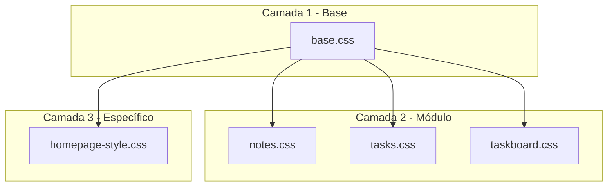
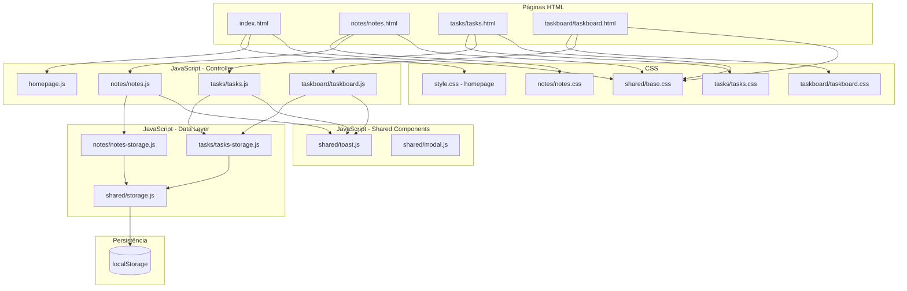
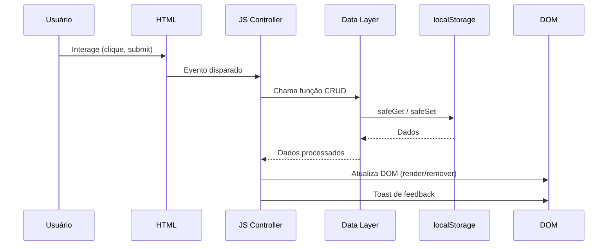

# Arquitetura — Blocks-Of-Note

> **Baseado em:** [`docs/visão.md`](visão.md) e [`docs/roadmap.md`](roadmap.md)  
> **Propósito:** Estabelecer decisões arquiteturais, convenções e uma base sólida para o desenvolvimento do projeto.

---

## 📑 Sumário

1. [Princípios Arquiteturais](#-princípios-arquiteturais)
2. [Estrutura de Diretórios](#-estrutura-de-diretórios)
3. [Arquitetura CSS](#-arquitetura-css)
4. [Arquitetura JavaScript](#-arquitetura-javascript)
5. [Camada de Dados — Data Layer](#-camada-de-dados--data-layer)
6. [Sistema de Componentes](#-sistema-de-componentes)
7. [Convenções de Código](#-convenções-de-código)
8. [Estratégia de Erros](#-estratégia-de-erros)
9. [Diagrama de Arquitetura Geral](#-diagrama-de-arquitetura-geral)
10. [Glossário de Decisões](#-glossário-de-decisões)

---

---

## 🛠 Stack Tecnológica

| Camada | Tecnologia | Detalhes |
|--------|-----------|----------|
| **Linguagem** | HTML5 + CSS3 + JavaScript (Vanilla) | Sem frameworks ou bibliotecas externas |
| **Renderização 3D** | CSS3 3D Transforms | `perspective`, `transform-style: preserve-3d`, `rotateX/Y/Z`, `translateZ` |
| **Persistência** | `localStorage` (Web Storage API) | Dados salvos no navegador do usuário |
| **Tipografia** | Fonte **Geometra** + `Courier New` / monospace | Estilo bold e monoespaçado |
| **Design System** | Brutalist + Notion-inspired | Monocromático (preto/branco) com acentos coloridos |
| **Backend** | ❌ Nenhum | 100% client-side |
| **Build tools** | ❌ Nenhum | Arquivos estáticos puros |
| **Testes** | Vitest (unitários) + Playwright (E2E) | Testes em `tests/` e `e2e/` |

### Dependências externas

**Zero dependências de runtime.** O projeto utiliza apenas ferramentas de desenvolvimento (devDependencies):
- `vitest` — Testes unitários
- `@playwright/test` — Testes end-to-end

Todo o código de produção é vanilla JavaScript sem npm, CDNs, bibliotecas JS ou CSS frameworks.

---

## 🧱 Princípios Arquiteturais

### 1. KISS (Keep It Simple, Stupid)
O projeto é **vanilla JavaScript** — sem frameworks, sem bundlers, sem dependências externas. Cada nova dependência deve ser justificada com uma razão clara.

### 2. Separação por Camadas
O código deve ser organizado em três camadas distintas dentro de cada módulo:

| Camada | Responsabilidade | O que NÃO fazer |
|--------|-----------------|-----------------|
| **Data Layer** | CRUD no `localStorage`, validação de dados, transformação | Manipular DOM, estilos |
| **UI Layer** | Renderização de elementos, manipulação de DOM, animações CSS | Acessar `localStorage` diretamente |
| **Controller Layer** | Orquestrar eventos, conectar Data e UI, tratar entradas do usuário | Lógica de persistência ou renderização complexa |

### 3. CSS modular por componente
Cada página tem seu próprio CSS. Estilos compartilhados vão para `base.css`. Evitar estilos inline e `!important`.

### 4. Persistência isolada em módulo próprio
Toda interação com `localStorage` deve passar por funções dedicadas em arquivos separados (ex: `storage.js`), nunca espalhadas pelo código.

### 5. Acessibilidade como requisito, não adicional
ARIA, navegação por teclado e `prefers-reduced-motion` devem ser considerados desde o início, não adicionados depois.

---

## 📁 Estrutura de Diretórios

```
Blocks-Of-Note/
│
├── index.html                 # Homepage — menu 3D principal
├── homepage.js                # Lógica da homepage
│
├── notes/
│   ├── notes.html             # Página de notas (antigo paginanot.html)
│   ├── notes.js               # Controller — lógica de notas
│   ├── notes.css              # Estilos específicos de notas
│   └── notes-storage.js       # Data Layer — CRUD de notas
│
├── tasks/
│   ├── tasks.html             # Página de tarefas (antigo paginatask.html)
│   ├── tasks.js               # Controller — lógica de tarefas
│   ├── tasks.css              # Estilos específicos de tarefas
│   └── tasks-storage.js       # Data Layer — CRUD de tarefas
│
├── taskboard/
│   ├── taskboard.html         # Board de visualização de tarefas (novo)
│   ├── taskboard.js           # Controller
│   └── taskboard.css          # Estilos do board
│
├── shared/
│   ├── base.css               # CSS compartilhado (cubos 3D, variáveis, reset)
│   ├── storage.js             # Data Layer genérico — funções utilitárias de localStorage
│   ├── toast.js               # Componente de toast reutilizável
│   ├── toast.css              # Estilos do toast
│   ├── modal.js               # Lógica base de modal (se abstraída)
│   └── utils.js               # Funções utilitárias gerais
│
├── docs/
│   ├── visão.md               # Análise do projeto
│   ├── roadmap.md             # Roadmap de evolução
│   └── arquitetura.md         # Este documento
│
├── tests/
│   ├── storage.test.js        # Testes da camada de dados
│   ├── notes.test.js          # Testes do controller de notas
│   └── tasks.test.js          # Testes do controller de tarefas
│
├── e2e/
│   ├── notes.spec.js          # Testes end-to-end de notas
│   └── tasks.spec.js          # Testes end-to-end de tarefas
│
├── README.md
└── package.json               # Apenas para testes (Vitest, Playwright)
```

> **Decisão:** Os arquivos foram reorganizados em pastas por funcionalidade (`notes/`, `tasks/`) em vez de arquivos soltos na raiz. Isso escala melhor conforme novas features são adicionadas. A migração deve ser feita na **Fase 1** do roadmap, após os hotfixes.

---

## 🎨 Arquitetura CSS

### 3 camadas de CSS



### Camada 1 — `shared/base.css`

**Conteúdo:**
- Reset CSS mínimo (`*, *::before, *::after { box-sizing: border-box; margin: 0; padding: 0; }`)
- Variáveis CSS globais (`:root`)
- Definições de cubo 3D base (`.face`, `.cube`, `.scene`)
- Posicionamento das 6 faces (`.front`, `.back`, `.right`, `.left`, `.top`, `.bottom`)
- `@keyframes spin` unificado
- `@font-face` para Geometra (se disponível) ou fallback
- Regras de `prefers-reduced-motion`

**Variáveis CSS globais (`:root`):**

```css
:root {
    /* Cores */
    --color-bg: #ffffff;
    --color-text: #000000;
    --color-border: #000000;
    --color-accent-green: #22c55e;
    --color-accent-yellow: #eab308;
    --color-accent-red: #ef4444;
    --color-accent-blue: #3b82f6;
    --color-surface: #f7f7f7;
    --color-text-muted: #888888;
    --color-divider: #eeeeee;

    /* Dimensões de cubo */
    --cube-main-size: 200px;
    --cube-main-half: calc(var(--cube-main-size) / 2);
    --cube-small-size: 80px;
    --cube-small-half: calc(var(--cube-small-size) / 2);
    --cube-mini-size: 40px;
    --cube-mini-half: calc(var(--cube-mini-size) / 2);

    /* Tipografia */
    --font-display: 'Geometra', sans-serif;
    --font-mono: 'Courier New', Courier, monospace;

    /* Transições */
    --ease-elastic: cubic-bezier(0.175, 0.885, 0.32, 1.275);
    --transition-fast: 0.3s ease;
    --transition-normal: 0.5s ease;
    --transition-slow: 0.8s var(--ease-elastic);

    /* Bordas */
    --border-thick: 6px solid var(--color-border);
    --border-thin: 2px solid var(--color-border);
}
```

### Camada 2 — CSS de Módulo (ex: `notes.css`, `tasks.css`)

**Conteúdo:**
- Estilos específicos do módulo
- Media queries específicas do módulo
- Animações específicas (ex: `orbit2D`, `shakeCube`)
- Variáveis CSS locais (ex: `--orbit-radius: 260px`)

### Camada 3 — CSS de Página/Específico

A página `index.html` pode ter um CSS próprio (atual `style.css`) apenas com estilos que não se aplicam a nenhum outro lugar.

### Regras de Responsividade

Usar **mobile-first** como padrão:

```css
/* Base: mobile */
.cube { width: 120px; }

/* Tablet+ */
@media (min-width: 768px) {
    .cube { width: 200px; }
}
```

Usar `clamp()` para dimensões que precisam de escalonamento suave:

```css
--cube-main-size: clamp(120px, 20vw, 200px);
```

### Regras de Acessibilidade CSS

Sempre incluir:

```css
/* Foco visível */
:focus-visible {
    outline: 3px solid var(--color-border);
    outline-offset: 3px;
}

/* Redução de movimento */
@media (prefers-reduced-motion: reduce) {
    *, *::before, *::after {
        animation-duration: 0.01ms !important;
        animation-iteration-count: 1 !important;
        transition-duration: 0.01ms !important;
    }
}
```

---

## ⚙️ Arquitetura JavaScript

### Padrão: Module Pattern (sem frameworks)

Cada módulo JS segue esta estrutura:

```javascript
// ============================================
// MODULE: Notes
// Arquivo: notes/notes.js
// Dependências: notes-storage.js, shared/toast.js
// ============================================

import { NoteStorage } from './notes-storage.js';
import { Toast } from '../shared/toast.js';

const NotesApp = (() => {
    // --- State ---
    const state = {
        currentNoteId: null,
        isRemovingMode: false,
    };

    // --- DOM References ---
    const elements = {
        mainContainer: document.getElementById('main-container'),
        btnCreate: document.getElementById('btn-create'),
        btnRemove: document.getElementById('btn-remove'),
        orbitContainer: document.getElementById('notes-orbit'),
        modal: document.getElementById('note-modal'),
        // ...
    };

    // --- Init ---
    function init() {
        loadExistingNotes();
        bindEvents();
    }

    function loadExistingNotes() {
        const notes = NoteStorage.getAll();
        notes.forEach(note => renderCube(note.id));
    }

    // --- Events ---
    function bindEvents() {
        elements.btnCreate.addEventListener('click', handleCreate);
        elements.btnRemove.addEventListener('click', handleRemoveMode);
        // ...
    }

    function handleCreate(e) {
        e.stopPropagation();
        const note = NoteStorage.create({ title: '', content: '' });
        renderCube(note.id);
        elements.mainContainer.classList.remove('active');
        Toast.show('Nota criada!');
    }

    // --- Render ---
    function renderCube(id) {
        // ... renderização do mini cubo
    }

    function openEditor(id) {
        state.currentNoteId = id;
        const note = NoteStorage.getById(id);
        // ... preencher modal
        elements.modal.classList.add('modal-open');
    }

    function saveNote() {
        const title = document.getElementById('note-title-input').value;
        const content = document.getElementById('note-text').value;
        NoteStorage.update(state.currentNoteId, { title, content });
        elements.modal.classList.remove('modal-open');
        Toast.show('Nota salva!');
    }

    // --- Public API ---
    return { init };
})();

// Auto-init
document.addEventListener('DOMContentLoaded', () => NotesApp.init());
```

### Convenções

| Aspecto | Regra |
|---------|-------|
| **Escopo** | Cada módulo em um arquivo separado |
| **State** | Objeto `state` no topo do módulo, nunca variáveis soltas |
| **DOM refs** | Agrupadas em um objeto `elements` |
| **Event handlers** | Nomeados (`handleCreate`, `handleRemoveMode`), nunca funções anônimas inline |
| **Init** | Função `init()` explícita, chamada no `DOMContentLoaded` |
| **Separação** | Data Layer em arquivo separado (`*-storage.js`) |

### Nomenclatura

| Tipo | Padrão | Exemplo |
|------|--------|---------|
| Variáveis | `camelCase` | `currentNoteId` |
| Constantes | `UPPER_SNAKE_CASE` | `STORAGE_KEY` |
| Funções | `camelCase` | `renderCube`, `openEditor` |
| Classes CSS | `kebab-case` | `mini-note-scene`, `modal-open` |
| IDs | `kebab-case` | `btn-save-task`, `note-title-input` |
| Arquivos | `kebab-case` | `notes-storage.js` |

---

## 💾 Camada de Dados — Data Layer

### Módulo `shared/storage.js` — Utilitário genérico

```javascript
const Storage = (() => {
    function safeGet(key, fallback = null) {
        try {
            const data = localStorage.getItem(key);
            return data ? JSON.parse(data) : fallback;
        } catch (e) {
            console.error(`Storage.get(${key}) failed:`, e);
            return fallback;
        }
    }

    function safeSet(key, value) {
        try {
            localStorage.setItem(key, JSON.stringify(value));
            return true;
        } catch (e) {
            if (e.name === 'QuotaExceededError') {
                Toast.show('Espaço de armazenamento cheio. Libere espaço ou exporte seus dados.');
            } else {
                console.error(`Storage.set(${key}) failed:`, e);
            }
            return false;
        }
    }

    function safeRemove(key) {
        try {
            localStorage.removeItem(key);
        } catch (e) {
            console.error(`Storage.remove(${key}) failed:`, e);
        }
    }

    return { safeGet, safeSet, safeRemove };
})();
```

### Módulo `notes/notes-storage.js` — Data Layer de Notas

```javascript
const STORAGE_KEY = 'my_3d_notes';

const NoteStorage = (() => {
    function getAll() {
        return Storage.safeGet(STORAGE_KEY, []);
    }

    function getById(id) {
        return getAll().find(n => n.id === id) || null;
    }

    function create(data) {
        const notes = getAll();
        const note = {
            id: Date.now(),
            title: data.title || '',
            content: data.content || '',
            createdAt: new Date().toISOString(),
            updatedAt: new Date().toISOString(),
        };
        notes.push(note);
        Storage.safeSet(STORAGE_KEY, notes);
        return note;
    }

    function update(id, data) {
        const notes = getAll();
        const idx = notes.findIndex(n => n.id === id);
        if (idx === -1) return false;
        notes[idx] = { ...notes[idx], ...data, updatedAt: new Date().toISOString() };
        Storage.safeSet(STORAGE_KEY, notes);
        return true;
    }

    function remove(id) {
        let notes = getAll();
        notes = notes.filter(n => n.id !== id);
        Storage.safeSet(STORAGE_KEY, notes);
    }

    function search(query) {
        const q = query.toLowerCase();
        return getAll().filter(n =>
            n.title.toLowerCase().includes(q) ||
            n.content.toLowerCase().includes(q)
        );
    }

    function exportToJSON() {
        const data = {
            exportDate: new Date().toISOString(),
            version: 1,
            notes: getAll(),
        };
        const blob = new Blob([JSON.stringify(data, null, 2)], { type: 'application/json' });
        const url = URL.createObjectURL(blob);
        const a = document.createElement('a');
        a.href = url;
        a.download = `blocks-of-note-export-${Date.now()}.json`;
        a.click();
        URL.revokeObjectURL(url);
    }

    return { getAll, getById, create, update, remove, search, exportToJSON };
})();
```

### Schema dos dados

**Nota:**
```json
{
    "id": 1712345678901,
    "title": "Minha Nota",
    "content": "Conteúdo da nota...",
    "createdAt": "2026-05-21T20:00:00.000Z",
    "updatedAt": "2026-05-21T21:30:00.000Z"
}
```

**Tarefa:**
```json
{
    "id": 1712345678902,
    "title": "Comprar mantimentos",
    "date": "2026-05-25",
    "time": "14:00",
    "location": "Supermercado Central",
    "description": "Levar lista de compras",
    "urgency": "medium",
    "createdAt": "2026-05-21T20:00:00.000Z",
    "updatedAt": "2026-05-21T20:00:00.000Z"
}
```

> **Decisão:** Os schemas incluem `createdAt` e `updatedAt` em ISO 8601. O `id` continua sendo `Date.now()` por simplicidade. O campo `content` das notas será renomeado para `content` (já está assim). O campo `description` das tarefas é separado.

---

## 🧩 Sistema de Componentes

### Componente: Cubo 3D (abstração CSS)

O cubo 3D é um **componente puramente CSS** definido em `base.css`. Qualquer página pode criar um cubo com:

```html
<div class="scene">
    <div class="cube" id="my-cube">
        <div class="face front"></div>
        <div class="face back"></div>
        <div class="face right"></div>
        <div class="face left"></div>
        <div class="face top"></div>
        <div class="face bottom"></div>
    </div>
</div>
```

**Variantes de cubo:**

| Variante | Classe | Tamanho | Uso |
|----------|--------|---------|-----|
| Principal | `.cube-main` | `--cube-main-size` | Homepage, notas |
| Lateral | `.cube-side` | `--cube-small-size` | Menu homepage |
| Mini | `.cube-mini` | `--cube-mini-size` | Notas em órbita |
| Task | `.cube-task` | `150px` (fixo) | Indicador de urgência |

### Componente: Toast

```html
<!-- Adicionado dinamicamente pelo JS -->
<div class="toast" role="status" aria-live="polite">
    Nota salva!
</div>
```

```css
.toast {
    position: fixed;
    bottom: 24px;
    right: 24px;
    background: var(--color-text);
    color: var(--color-bg);
    padding: 12px 24px;
    font-family: var(--font-mono);
    font-size: 0.9rem;
    border-radius: 8px;
    opacity: 0;
    transform: translateY(16px);
    transition: opacity 0.3s ease, transform 0.3s ease;
    z-index: 9999;
    pointer-events: none;
}

.toast.visible {
    opacity: 1;
    transform: translateY(0);
}
```

### Componente: Modal

```html
<div id="note-modal" class="modal-overlay" role="dialog" aria-modal="true" aria-label="Editor de nota">
    <div class="modal-content">
        <!-- header, body, footer -->
    </div>
</div>
```

```css
.modal-overlay {
    display: none;
    position: fixed;
    inset: 0;
    background: rgba(255, 255, 255, 0.6);
    backdrop-filter: blur(10px);
    z-index: 2000;
    justify-content: center;
    align-items: center;
}

.modal-overlay.modal-open {
    display: flex;
}

.modal-content {
    animation: notionFadeIn 0.4s ease-out;
}

@keyframes notionFadeIn {
    from { transform: translateY(30px); opacity: 0; }
    to { transform: translateY(0); opacity: 1; }
}
```

---

## 🔄 Diagrama de Arquitetura Geral



### Fluxo de Dados Genérico



---

## 📋 Glossário de Decisões

| # | Decisão | Alternativa Considerada | Justificativa |
|---|---------|------------------------|---------------|
| 1 | **Vanilla JS sem frameworks** | React, Vue, Alpine | Projeto pequeno, sem estado complexo, zero dependências |
| 2 | **Pastas por funcionalidade** | Arquivos soltos na raiz | Melhor escalabilidade conforme novas features surgem |
| 3 | **Module Pattern com IIFE** | ES Modules nativos (`type="module"`) | ES Modules exigem servidor HTTP local (CORS), IIFE funciona direto do filesystem |
| 4 | **Data Layer separado** | Lógica misturada no controller | Testabilidade, reuso, responsabilidade única |
| 5 | **CSS em 3 camadas** | CSS único por página | Reuso de estilos de cubo 3D sem duplicação |
| 6 | **Mobile-first com `clamp()`** | Desktop-first com media queries apenas | Melhor experiência base em mobile, escala para cima |
| 7 | **`try/catch` no localStorage** | Sem tratamento | Prevenção de `QuotaExceededError` |
| 8 | **Toast para feedback** | Alert() ou modal de confirmação | Toast é não-intrusivo, não bloqueia fluxo |
| 9 | **Classes CSS para toggle de UI** | `style.display` direto no JS | Transições CSS funcionam, separação de concerns |
| 10 | **`prefers-reduced-motion` obrigatório** | Opcional / ignorar | Acessibilidade é requisito desde a fundação |
| 11 | **`Date.now()` como ID** | UUID, nanoId, auto-increment | Simplicidade, timestamp já serve como ordenação |
| 12 | **`createdAt`/`updatedAt` em ISO 8601** | Timestamp numérico | Legível, parseável, padrão ISO |

---

## 🚦 Estratégia de Migração

A estrutura atual (arquivos soltos) deve migrar para a nova estrutura (pastas por funcionalidade) seguindo esta ordem:

```
Fase 0: Hotfixes (mantém estrutura atual)
    ↓
Fase 1.1: Criar shared/base.css com estilos extraídos
    ↓
Fase 1.x: Criar pastas notes/, tasks/, shared/
    ↓
Fase 1.x: Mover arquivos para as pastas
    ↓
Fase 1.x: Criar shared/storage.js e notes-storage.js, tasks-storage.js
    ↓
Fase 1.x: Refatorar controllers para usar Data Layer
    ↓
Fase 2+: Continua com nova estrutura
```

> ⚠️ **Importante:** A migração de estrutura deve ser feita **após** os hotfixes (Fase 0). Durante a migração, manter os arquivos antigos funcionando até que os novos estejam completos e testados.

---

## 📋 Apêndice — Análise da Codebase Atual

### 1. Homepage — [`index.html`](../index.html) + [`homepage.js`](../homepage.js) + [`style.css`](../style.css)

**Funcionamento:**

- Tela inicial exibe um overlay de introdução com o texto **"BLOCKS F NOTES"** (grafia estilizada, não "OF") e um cubo 3D central animado.
- Após 2.5s o overlay começa a desaparecer com transição de opacidade; após 3.5s é removido do DOM e os cliques são liberados via classe `.allow-clicks`.
- O cubo central gira continuamente em 3D (animação `spin` de 12s).
- Ao clicar no cubo central, a classe `.active` é adicionada ao wrapper, fazendo com que dois cubos laterais apareçam deslizando horizontalmente com os rótulos "NOTAS" e "TAREFAS".
- Cada cubo lateral é um `<a>` que direciona para a respectiva página.
- Um clique fora do menu (no `document`) remove a classe `.active`, fechando o menu.

**Destaques de código:**

- **CSS 3D bem estruturado**: Uso de variáveis CSS (`--size-main`, `--half-size-main`, `--border-color`) para centralizar dimensões.
- **Animações suaves**: `cubic-bezier(0.175, 0.885, 0.32, 1.275)` para efeito elástico.
- **Transição de pointer-events**: Uso de classe `.allow-clicks` para liberar interação apenas após a intro.
- **JS híbrido**: Lógica de clique do menu está em script inline no [`index.html:60-74`](../index.html:60), enquanto a lógica da intro está no arquivo externo [`homepage.js`](../homepage.js).

**⚠️ Observação:** A classe CSS `.wrapper.active-intro` é declarada em [`style.css:65,281`](../style.css:65) mas **nunca é aplicada por nenhum JavaScript** — é CSS morto.

---

### 2. Página de Notas — [`paginanot.html`](../paginanot.html) + [`paginanot.js`](../paginanot.js) + [`paginanot.css`](../paginanot.css)

**Funcionamento:**

- Cubo central que, ao ser clicado, revela dois botões: **CREATE** (criar nota) e **REMOVE** (modo de exclusão).
- Ao criar uma nota via botão CREATE, um objeto `{ id, title, content }` é salvo no `localStorage` e um mini cubo 3D é renderizado dinamicamente em uma órbita 2D ao redor do cubo central.
- Clicar em um mini cubo (fora do modo REMOVE) abre um modal estilo Notion para editar título e conteúdo.
- O modal exibe a data de criação extraída do `id` (timestamp) via `new Date(id).toLocaleDateString('pt-BR')`.
- O modo REMOVE pausa as animações de órbita e rotação, altera a cor das bordas para vermelho e ativa um efeito "shake" nos mini cubos. Ao clicar em um mini cubo neste modo, a nota é removida do `localStorage` e o elemento some com animação de escala zero.
- Dados salvos no `localStorage` com a chave `my_3d_notes`.

**Destaques de código:**

- **Renderização dinâmica de cubos 3D**: Cada nota gera um elemento `.mini-note-scene` com um cubo 3D filho contendo 6 faces.
- **Órbita 2D via CSS**: Animação `orbit2D` com `rotate()` + `translateX(260px)` para criar movimento circular sem JS.
- **Delay aleatório nas órbitas**: `Math.random() * -12` segundos para dessincronizar a rotação dos mini cubos.
- **Modal Notion-style**: Design limpo com `padding: 60px 80px`, `backdrop-filter: blur(10px)`, bordas sutis e animação de fade-in.
- **Proteção contra duplo clique na remoção**: A classe `.removing-animation` aplica `pointer-events: none` no elemento durante a animação de saída (300ms).
- **Scrollbar customizada**: Estilização do `::-webkit-scrollbar` no textarea.

---

### 3. Página de Tarefas — [`paginatask.html`](../paginatask.html) + [`paginatask.js`](../paginatask.js) + [`paginatask.css`](../paginatask.css)

**Funcionamento:**

- Formulário dividido em duas colunas:
  - **Esquerda (formulário)**: Campo de título, data, hora, local, descrição (textarea) e botão "SALVAR_TAREFA".
  - **Direita (cubo + controle)**: Cubo 3D com uma inclinação fixa (`rotateX(-20deg)`) que muda de cor conforme o grau de urgência selecionado.
- Seletor de urgência com 4 níveis numerados de I a IV: Baixa (verde), Média (amarelo), Alta (vermelho), Extra (azul).
- Legenda com bolinhas coloridas ao lado do cubo.

**⚠️ Bugs e problemas identificados:**

1. **Seletor de urgência quebrado** — O HTML em [`paginatask.html:54-58`](../paginatask.html:54) define `value="low"`, `value="medium"`, `value="high"`, `value="extra"` mas o JS em [`paginatask.js:9-15`](../paginatask.js:9) verifica `selectUrgency.value == "1"`, `"2"`, `"3"`. Como os **valores nunca correspondem**, o cubo **nunca muda de cor**.
2. **Nível "extra" (IV) ignorado** — Mesmo que a lógica fosse corrigida, o valor `"extra"` não tem nenhum `else if` correspondente no JS.
3. **Botão "SALVAR_TAREFA" sem funcionalidade** — O elemento `<button id="btn-save-task">` em [`paginatask.html:36`](../paginatask.html:36) não possui **nenhum** event listener registrado em [`paginatask.js`](../paginatask.js). Nenhum dado de tarefa é persistido.
4. **Animação `spin` sobrescreve o `rotateY` inicial do cubo** — Em [`paginatask.css:121`](../paginatask.css:121) o cubo tem `transform: rotateX(-20deg) rotateY(30deg)`, mas a animação `spin` em [`paginatask.css:170-174`](../paginatask.css:170) define `from { transform: rotateX(-20deg) rotateY(0deg) }`. A animação sobrescreve a propriedade `transform` do elemento, fazendo o `rotateY(30deg)` inicial ser ignorado.

---

### 4. Task Board — [`taskboard/taskboard.html`](../taskboard/taskboard.html) + [`taskboard/taskboard.js`](../taskboard/taskboard.js) + [`taskboard/taskboard.css`](../taskboard/taskboard.css)

**Funcionamento:**

- Página que lista todas as tarefas salvas no `localStorage` em formato de cards.
- Cards exibem título, data, local e badge de urgência com cor.
- Filtro por nível de urgência via `<select>`.
- Campo de busca textual que filtra por título, local e descrição.
- Botão de exclusão com confirmação via `confirm()`.
- Estatísticas no topo: total de tarefas e contagem por nível de urgência.
- Estado vazio com mensagem e ilustração quando não há tarefas.

**Destaques de código:**

- **Renderização de cards**: Função `renderTasks()` que limpa e recria todos os cards do DOM.
- **Filtragem combinada**: Filtro por urgência e busca textual funcionam simultaneamente.
- **Badge de urgência**: Classe CSS dinâmica (`.badge-low`, `.badge-medium`, `.badge-high`, `.badge-extra`) com cores correspondentes.
- **Responsividade básica**: Media query para empilhamento vertical em telas menores.

---

## Pontos Fortes Técnicos

### 🎨 Design e Experiência do Usuário

1. **Identidade visual marcante** — A metáfora do cubo 3D é criativa, consistente e diferencia o projeto visualmente.
2. **Design system coeso** — Paleta monocromática, tipografia bold, bordas grossas e espaçamentos generosos criam uma identidade única em todas as páginas.
3. **Transições e animações refinadas** — Uso de `cubic-bezier` para curvas elásticas, timings consistentes, animações de entrada e saída suaves.
4. **Modal Notion bem executado** — Design limpo, `padding` generoso, `backdrop-filter: blur()` no fundo, animação de fade-in com `translateY`.

### 🏗️ Código e Arquitetura

5. **CSS bem organizado** — Uso de variáveis CSS no `:root`, comentários de seção, nomenclatura clara de classes e IDs.
6. **Separação por página** — Cada funcionalidade em seu próprio conjunto HTML/CSS/JS, facilitando navegação e manutenção.
7. **Vanilla JS sem dependências** — Zero bloat de frameworks, carregamento instantâneo sem necessidade de build.
8. **Persistência offline funcional** — Dados sobrevivem a recarregamentos da página via `localStorage`.
9. **Animações CSS eficientes** — Animações declarativas (`transform`, `opacity`) que podem ser aceleradas por GPU, sem uso de JS para cálculo de quadros.

### 🔧 Engenharia

10. **Código CSS comentado** — Seções claramente demarcadas (ex: `/* --- CUBO CENTRAL --- */`, `/* --- LÓGICA DE ATIVAÇÃO DO MENU --- */`).
11. **Uso de variáveis CSS** — Dimensões (`--size-main`, `--half-mini`) e cores centralizadas no `:root` em cada folha de estilo.
12. **Proteção contra cliques durante remoção** — [`paginanot.css:354-359`](../paginanot.css:354) define `pointer-events: none` na animação de saída dos mini cubos, prevenindo duplo clique.

---

> **Documento gerado em:** 21/05/2026
> **Baseado em:** [`docs/visão.md`](visão.md) e [`docs/roadmap.md`](roadmap.md)
> **Propósito:** Definir a base arquitetural do Blocks-Of-Note para guiar todo o desenvolvimento futuro.
