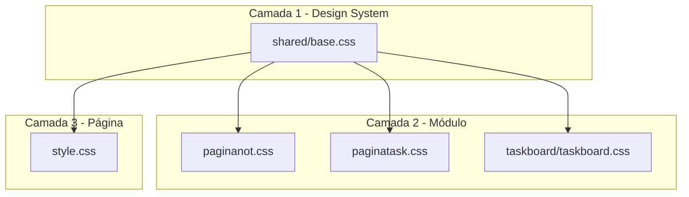
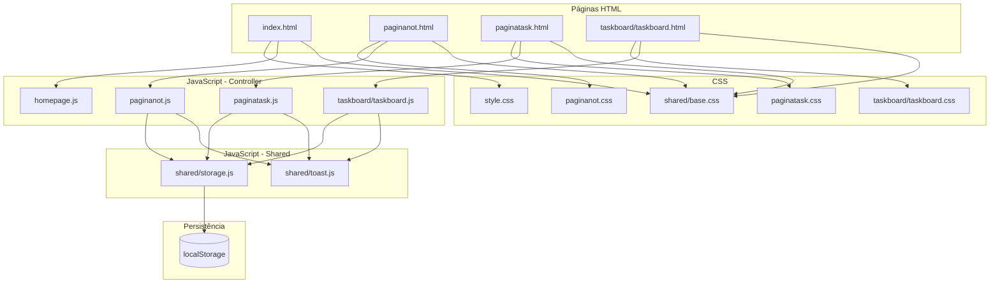
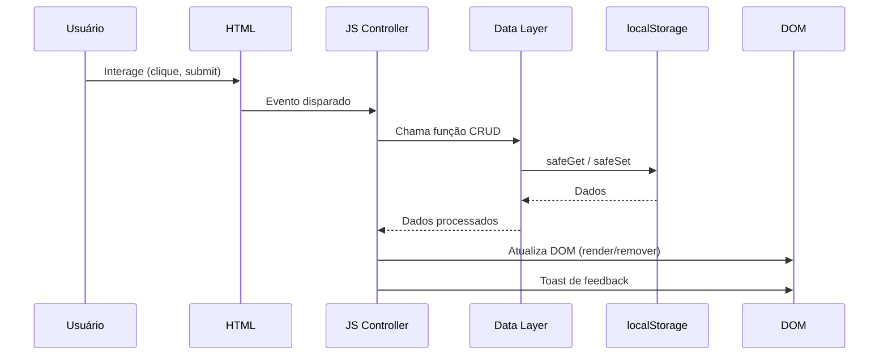

# Arquitetura — Blocks-Of-Note

> **Baseado em:** [`docs/specs.md`](specs.md)
> **Propósito:** Estabelecer decisões arquiteturais, convenções e a base sólida do projeto após a simplificação da interface.

---

## 📑 Sumário

1. [Stack Tecnológica](#-stack-tecnológica)
2. [Estrutura de Diretórios](#-estrutura-de-diretórios)
3. [Arquitetura CSS — Design System](#-arquitetura-css--design-system)
4. [Arquitetura JavaScript — Module Pattern](#-arquitetura-javascript--module-pattern)
5. [Camada de Dados — Data Layer](#-camada-de-dados--data-layer)
6. [Sistema de Componentes](#-sistema-de-componentes)
7. [Diagrama de Arquitetura Geral](#-diagrama-de-arquitetura-geral)
8. [Glossário de Decisões](#-glossário-de-decisões)

---

## 🛠 Stack Tecnológica

| Camada | Tecnologia | Detalhes |
|--------|-----------|----------|
| **Linguagem** | HTML5 + CSS3 + JavaScript (Vanilla) | Zero frameworks ou bibliotecas de runtime |
| **Persistência** | `localStorage` (Web Storage API) | Dados salvos no navegador do usuário |
| **Tipografia** | Bebas Neue (Google Fonts) + Courier New | Display bold + monoespaçado para corpo |
| **Design System** | Brutalist monochrome | Preto/branco com acentos coloridos para estados |
| **Backend** | ❌ Nenhum | 100% client-side |
| **Build tools** | ❌ Nenhum | Arquivos estáticos puros |
| **Testes unitários** | Vitest v3.1 | `tests/` |
| **Testes E2E** | Playwright v1.60 | `e2e/` |

### Dependências externas

**Zero dependências de runtime.** Apenas devDependencies:
- `vitest` — Testes unitários
- `@playwright/test` — Testes end-to-end

---

## 🧱 Princípios Arquiteturais

### 1. KISS (Keep It Simple, Stupid)
Vanilla JavaScript — sem frameworks, sem bundlers, sem dependências externas.

### 2. Separação por Camadas
Cada módulo JS organiza-se em três camadas:

| Camada | Responsabilidade |
|--------|-----------------|
| **Data Layer** | CRUD no `localStorage`, validação de dados, transformação |
| **UI Layer** | Renderização de elementos, manipulação de DOM, animações CSS |
| **Controller Layer** | Orquestrar eventos, conectar Data e UI, tratar entradas do usuário |

### 3. CSS modular por componente
Cada página tem seu próprio CSS. Estilos compartilhados vão para `shared/base.css`. Evitar estilos inline e `!important`.

### 4. Persistência isolada
Toda interação com `localStorage` passa por `Storage.safeGet/safeSet/safeRemove` em `shared/storage.js`.

### 5. Acessibilidade como requisito
ARIA, navegação por teclado, `prefers-reduced-motion` e `:focus-visible` são considerados desde o início.

---

## 📁 Estrutura de Diretórios

```
Blocks-Of-Note/
│
├── index.html                 # Homepage — cards de navegação
├── homepage.js                # Lógica da homepage (IIFE)
├── style.css                  # Estilos específicos da homepage
│
├── paginanot.html             # Página de notas — grid de cards
├── paginanot.js               # Controller de notas (IIFE)
├── paginanot.css              # Estilos específicos de notas
│
├── paginatask.html            # Página de tarefas — formulário
├── paginatask.js              # Controller de tarefas (IIFE)
├── paginatask.css             # Estilos específicos de tarefas
│
├── taskboard/
│   ├── taskboard.html         # Board de visualização de tarefas
│   ├── taskboard.js           # Controller (IIFE)
│   └── taskboard.css          # Estilos do board
│
├── shared/
│   ├── base.css               # Design system: variáveis, componentes, reset
│   ├── storage.js             # Data Layer genérico (safeGet, safeSet, safeRemove)
│   ├── toast.js               # Componente de toast reutilizável
│   └── toast.css              # Estilos do toast
│
├── docs/
│   ├── specs.md               # Especificações técnicas completas
│   ├── arquitetura.md         # Este documento
│   ├── roadmap.md             # Roadmap de evolução
│   └── visão.md               # Visão do produto
│
├── plans/
│   └── pontos-de-melhoria.md  # Plano de melhorias
│
├── tests/
│   ├── storage.test.js        # Testes da camada de dados
│   ├── notes.test.js          # Testes de notas
│   └── tasks.test.js          # Testes de tarefas
│
├── e2e/
│   ├── notes.spec.js          # Testes end-to-end de notas
│   └── tasks.spec.js          # Testes end-to-end de tarefas
│
├── README.md
└── package.json               # Apenas para testes (Vitest, Playwright)
```

---

## 🎨 Arquitetura CSS — Design System

### 3 camadas de CSS



### Camada 1 — `shared/base.css`

**Conteúdo:**
- Reset CSS mínimo
- Variáveis CSS globais (`:root`)
- Classes de componentes reutilizáveis (`.btn`, `.input`, `.select`, `.card`, `.btn-back`, `.divider`, `.sr-only`)
- Regras de acessibilidade (`:focus-visible`, `prefers-reduced-motion`)
- Responsivo base (`.btn-back` em mobile)

**Variáveis CSS globais:**

```css
:root {
    /* Cores */
    --color-bg: #ffffff;
    --color-text: #000000;
    --color-text-muted: #888888;
    --color-border: #000000;
    --color-surface: #f5f5f5;
    --color-divider: #eaeaea;

    /* Cores de estado */
    --color-success: #22c55e;
    --color-success-bg: #dcfce7;
    --color-warning: #eab308;
    --color-warning-bg: #fef9c3;
    --color-error: #ef4444;
    --color-error-bg: #fee2e2;
    --color-info: #3b82f6;
    --color-info-bg: #dbeafe;

    /* Tipografia */
    --font-display: 'Bebas Neue', sans-serif;
    --font-mono: 'Courier New', Courier, monospace;

    /* Transições */
    --transition-fast: 0.2s ease;
    --transition-normal: 0.3s ease;

    /* Bordas */
    --border-thick: 3px solid var(--color-border);
    --border-thin: 2px solid var(--color-border);

    /* Sombras */
    --shadow-sm: 2px 2px 0px rgba(0,0,0,0.1);
    --shadow-md: 4px 4px 0px rgba(0,0,0,0.1);
    --shadow-lg: 6px 6px 0px rgba(0,0,0,0.08);
}
```

### Camada 2 — CSS de Módulo

Cada página tem seu próprio CSS com estilos específicos:
- **`paginanot.css`**: Grid de cards, modal overlay, animações de shake/entrada
- **`paginatask.css`**: Form layout, meta grid, indicador de urgência, sidebar
- **`taskboard/taskboard.css`**: Grid de cards do board, barra de urgência, empty state

### Camada 3 — CSS de Página

- **`style.css`**: Estilos exclusivos da homepage (cards de navegação, animação de entrada)

---

## ⚙️ Arquitetura JavaScript — Module Pattern

### Padrão: IIFE (Immediately Invoked Function Expression)

Cada módulo JS segue esta estrutura:

```javascript
const NotesApp = (() => {
    'use strict';

    // --- Constantes ---
    const STORAGE_KEY = 'my_3d_notes';
    const LIMITS = { TITLE_MAX: 200, CONTENT_MAX: 5000 };

    // --- State ---
    const state = {
        currentNoteId: null,
        isRemovingMode: false,
    };

    // --- DOM References ---
    const elements = {
        grid: document.getElementById('notes-grid'),
        btnCreate: document.getElementById('btn-create'),
        // ...
    };

    // --- Data Layer ---
    function getNotes() { ... }
    function saveNotes(notes) { ... }

    // --- UI Layer ---
    function renderCard(note) { ... }
    function render(notes) { ... }

    // --- Controller ---
    function handleCreate() { ... }
    function bindEvents() { ... }

    function init() {
        loadAndRender();
        bindEvents();
    }

    return { init, createAndRender };
})();

document.addEventListener('DOMContentLoaded', () => NotesApp.init());
```

### Convenções

| Aspecto | Regra |
|---------|-------|
| **Escopo** | Cada módulo em um arquivo separado, encapsulado em IIFE |
| **State** | Objeto `state` no topo do módulo |
| **DOM refs** | Agrupadas em objeto `elements` |
| **Event handlers** | Nomeados (`handleCreate`, `handleSave`) |
| **Init** | Função `init()` explícita, chamada no `DOMContentLoaded` |
| **Separação** | Data Layer, UI Layer e Controller em seções comentadas |

### Nomenclatura

| Tipo | Padrão | Exemplo |
|------|--------|---------|
| Variáveis | `camelCase` | `currentNoteId` |
| Constantes | `UPPER_SNAKE_CASE` | `STORAGE_KEY` |
| Funções | `camelCase` | `renderCard`, `openEditor` |
| Classes CSS | `kebab-case` | `note-card`, `modal-open` |
| IDs | `kebab-case` | `btn-save-task`, `note-title-input` |
| Arquivos | `kebab-case` | `paginanot.js` |

---

## 💾 Camada de Dados — Data Layer

### Módulo `shared/storage.js` — Utilitário genérico

```javascript
const Storage = (() => {
    function safeGet(key, fallback = null) { ... }
    function safeSet(key, value) { ... }
    function safeRemove(key) { ... }
    return { safeGet, safeSet, safeRemove };
})();
```

Todas as operações de `localStorage` são envolvidas em `try/catch` com tratamento de `QuotaExceededError`.

### Chaves do localStorage

| Chave | Conteúdo | Gerenciado por |
|-------|----------|----------------|
| `my_3d_notes` | Array de notas | `paginanot.js` |
| `my_3d_tasks` | Array de tarefas | `paginatask.js`, `taskboard.js` |

---

## 🧩 Sistema de Componentes

### Componente: Toast

Notificação não-intrusiva que aparece no canto inferior direito.

```javascript
Toast.show('Nota salva', { type: 'success', duration: 2000 });
// types: 'success' | 'error' | 'info' | 'warning'
```

### Componente: Modal

Overlay com backdrop blur para edição de notas.

```html
<div id="note-modal" class="modal-overlay" role="dialog" aria-modal="true" aria-label="Editor de nota">
    <div class="modal-content">
        <!-- header, body, footer -->
    </div>
</div>
```

### Componente: Urgency Preview

Indicador visual de urgência na página de tarefas, com classes dinâmicas `urgency-low`, `urgency-medium`, `urgency-high`, `urgency-extra`.

### Componente: Task Card

Card de tarefa no Task Board com barra lateral colorida indicando urgência.

---

## 🔄 Diagrama de Arquitetura Geral



### Fluxo de Dados Genérico



---

## 📋 Glossário de Decisões

| # | Decisão | Alternativa Considerada | Justificativa |
|---|---------|------------------------|---------------|
| 1 | **Vanilla JS sem frameworks** | React, Vue, Alpine | Projeto pequeno, sem estado complexo, zero dependências |
| 2 | **Arquivos na raiz (não pastas)** | Pastas `notes/`, `tasks/` | Simplicidade, projeto pequeno, menos navegação |
| 3 | **Module Pattern com IIFE** | ES Modules nativos | ES Modules exigem servidor HTTP, IIFE funciona do filesystem |
| 4 | **Data Layer no mesmo arquivo** | Módulo separado `notes-storage.js` | Mantido inline por simplicidade, separado por comentários |
| 5 | **CSS em 3 camadas** | CSS único por página | Reuso de componentes sem duplicação |
| 6 | **Desktop-first com media queries** | Mobile-first | Interface otimizada para desktop, adaptada para mobile |
| 7 | **`try/catch` no localStorage** | Sem tratamento | Prevenção de `QuotaExceededError` |
| 8 | **Toast para feedback** | Alert() ou modal | Toast é não-intrusivo, não bloqueia fluxo |
| 9 | **Classes CSS para toggle de UI** | `style.display` direto | Transições CSS funcionam, separação de concerns |
| 10 | **`prefers-reduced-motion` obrigatório** | Opcional | Acessibilidade é requisito desde a fundação |
| 11 | **`Date.now()` como ID** | UUID, nanoId | Simplicidade, timestamp já serve como ordenação |
| 12 | **Bebas Neue (Google Fonts)** | Geometra.ttf (inexistente) | Fonte similar, carregada via CDN, sem arquivo faltando |

---

> **Documento gerado em:** 05/06/2026
> **Baseado em:** [`docs/specs.md`](specs.md)
> **Propósito:** Definir a base arquitetural do Blocks-Of-Note após simplificação da interface.
