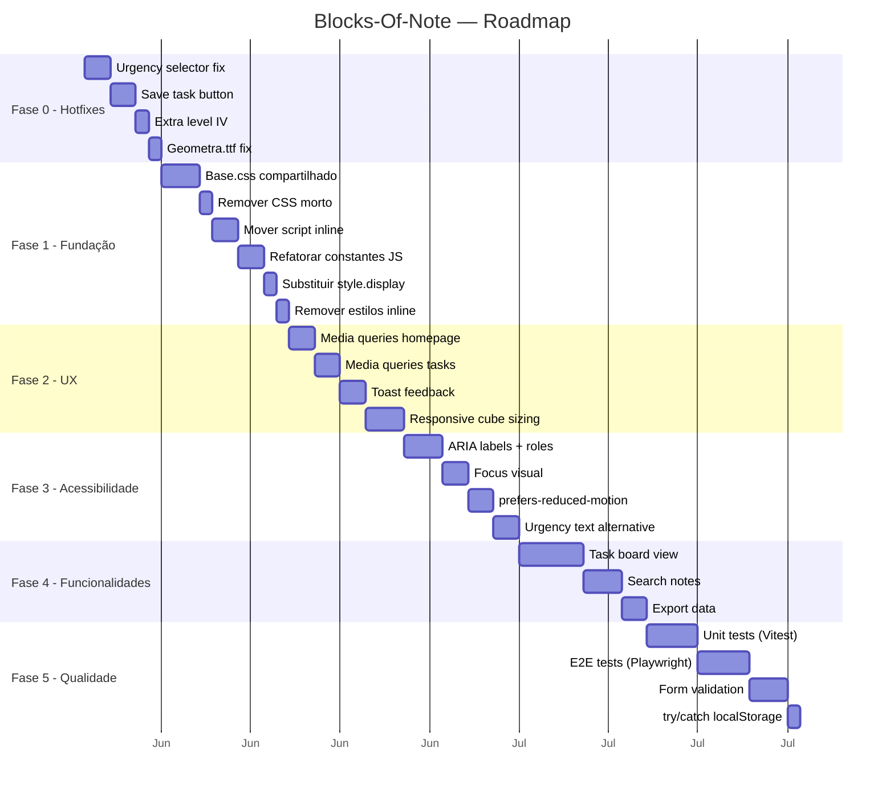
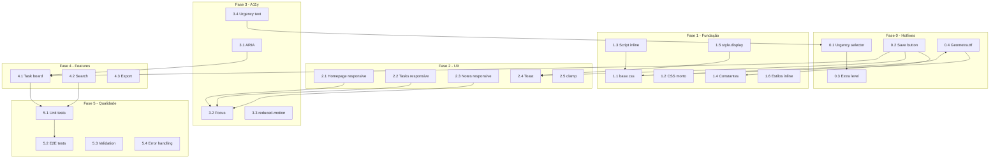

# Roadmap — Blocks-Of-Note

> **Baseado em:** [`docs/visão.md`](visão.md)  
> **Propósito:** Plano de evolução do projeto em fases incrementais, organizadas por prioridade e dependência técnica.

---

## Visão Geral das Fases

| Fase | Nome | Foco | Prioridade |
|------|------|------|------------|
| **0** | Hotfixes | Correção de bugs críticos que impedem o funcionamento | 🔴 Imediata |
| **1** | Fundação | Refatoração de código, redução de duplicação, organização | 🟡 Curto prazo |
| **2** | Experiência do Usuário | Responsividade mobile, feedback visual, refinamentos de UI | 🟡 Curto prazo |
| **3** | Acessibilidade | ARIA, teclado, prefers-reduced-motion, contraste | 🟢 Médio prazo |
| **4** | Novas Funcionalidades | Board de tarefas, busca, exportação de dados | 🟢 Médio prazo |
| **5** | Qualidade e Testes | Testes automatizados, validação, tratamento de erros | 🟢 Médio prazo |
| **6** | Visão de Futuro | Ideias para evolução do projeto além do escopo atual | 🔵 Longo prazo |

---

## 📐 Especificações Técnicas (Specs)

> As especificações abaixo são vinculantes para todas as fases do roadmap. Nenhuma implementação deve divergir destas specs sem discussão e atualização documentada.

### 💾 Data Layer — Schemas

**Nota (`my_3d_notes`):**
```json
{
    "id": 1712345678901,
    "title": "Minha Nota",
    "content": "Conteúdo da nota...",
    "createdAt": "2026-05-21T20:00:00.000Z",
    "updatedAt": "2026-05-21T21:30:00.000Z"
}
```

**Tarefa (`my_3d_tasks`):**
```json
{
    "id": 1712345678902,
    "title": "Comprar mantimentos",
    "date": "2026-05-25",
    "time": "14:00",
    "location": "Supermercado Central",
    "description": "Levar lista de compras",
    "urgency": "medium",
    "createdAt": "2026-05-21T20:00:00.000Z",
    "updatedAt": "2026-05-21T20:00:00.000Z"
}
```

**Valores válidos de `urgency`:**
| Valor | Label | Classe CSS | Cor |
|-------|-------|-----------|-----|
| `low` | I (Baixa) | `.low` | Verde (`#22c55e`) |
| `medium` | II (Média) | `.medium` | Amarelo (`#eab308`) |
| `high` | III (Alta) | `.high` | Vermelho (`#ef4444`) |
| `extra` | IV (Extra) | `.extra` | Azul (`#3b82f6`) |

**Regras de dados:**
- `id` = `Date.now()` (timestamp milissegundos) — simplicidade e ordenação
- `createdAt` / `updatedAt` em ISO 8601 (UTC)
- Título: string, até 200 caracteres, obrigatório
- Conteúdo/descrição: string, até 10000 caracteres, opcional
- Data: string `YYYY-MM-DD`, opcional
- Hora: string `HH:MM`, opcional
- Local: string, até 200 caracteres, opcional
- Urgência: um dos 4 valores válidos, padrão `medium`

---

### 🎨 CSS — Arquitetura

| Spec | Regra |
|------|-------|
| **Camadas** | 3 camadas: `base.css` (compartilhado) → CSS de módulo → CSS específico |
| **Variáveis** | Todas as cores, dimensões e transições em variáveis CSS no `:root` |
| **Box-sizing** | `*, *::before, *::after { box-sizing: border-box; }` |
| **Cubo 3D** | Definição única em `base.css` (`.face`, `.cube`, `.scene`, posicionamento das 6 faces, `@keyframes spin`) |
| **Unidades** | `clamp()` para dimensões de cubo; `rem` para fontes; `px` para bordas |
| **Responsividade** | Mobile-first: base mobile, `@media (min-width: 768px)` para desktop |
| **Animações** | Apenas `transform` e `opacity` (GPU-accelerated); curvas `cubic-bezier` consistentes |
| **Foco** | `:focus-visible { outline: 3px solid #000; outline-offset: 3px; }` |
| **Reduced motion** | `@media (prefers-reduced-motion: reduce)` desabilita animações |
| **`!important`** | Proibido, exceto em `prefers-reduced-motion` |
| **Estilos inline** | Proibidos — usar classes CSS |

---

### ⚙️ JavaScript — Arquitetura

| Spec | Regra |
|------|-------|
| **Padrão** | Module Pattern com IIFE (não ES Modules) para compatibilidade com `file://` |
| **Separação** | 3 camadas: Data Layer → Controller → UI Layer (em arquivos separados) |
| **State** | Objeto `state` no topo do módulo — nunca variáveis soltas |
| **DOM refs** | Agrupadas em objeto `elements` |
| **Event handlers** | Nomeados (`handleCreate`), nunca funções anônimas inline |
| **Init** | Função `init()` explícita, chamada no `DOMContentLoaded` |
| **Data Layer** | Em arquivo separado (`*-storage.js`), com `safeGet`/`safeSet` com `try/catch` |
| **UI toggle** | Classes CSS para mostrar/esconder — nunca `style.display` direto |
| **IDs** | `kebab-case` (ex: `btn-save-task`) |
| **Constantes** | `UPPER_SNAKE_CASE` (ex: `STORAGE_KEY`) |
| **Toast** | Feedback não-intrusivo para todas as operações CRUD |
| **`localStorage`** | Toda operação envolvida em `try/catch` com fallback |

---

### ♿ Acessibilidade

| Spec | Critério |
|------|----------|
| **ARIA** | `role="button"`, `aria-label` em todos os elementos interativos |
| **Modal** | `role="dialog"`, `aria-modal="true"`, `aria-label` descritivo |
| **Teclado** | Todos os fluxos operáveis via `Tab` + `Enter`/`Escape` |
| **Foco** | `:focus-visible` com `outline` de 3px em todos os elementos focáveis |
| **Cor** | Urgência identificável também por texto/ícone, não apenas cor |
| **Movimento** | `prefers-reduced-motion: reduce` desliga animações |
| **Toast** | `role="status"`, `aria-live="polite"` |

---

### ⚡ Performance

| Spec | Limite |
|------|--------|
| **Tempo de load** | < 1s (arquivos estáticos, sem dependências) |
| **Animações** | Apenas `transform` + `opacity` (GPU) |
| **Renderização** | Mínimo de reflows — usar `classList.toggle` em vez de manipular `style` |
| **Memória** | Notas/tarefas: sem limite máximo, mas testado até 1000 itens |

---

### 🧪 Testes

| Spec | Cobertura |
|------|-----------|
| **Unitários (Vitest)** | Data Layer (CRUD, busca, exportação), funções puras do controller |
| **E2E (Playwright)** | Fluxos completos: criar nota, editar, excluir; criar tarefa, validar, board |
| **Responsividade** | Teste em viewport 375px (mobile) e 1280px (desktop) |
| **Acessibilidade** | Verificação de ARIA labels, foco visível, navegação por teclado |

---

### 🌐 Suporte a Navegadores

| Navegador | Versão mínima |
|-----------|---------------|
| Chrome | 90+ |
| Firefox | 90+ |
| Edge | 90+ |
| Safari | 15+ |

> Requisitos: CSS3 3D Transforms, `clamp()`, `prefers-reduced-motion`, `backdrop-filter`, ES2020.

---



---

## Fase 0 — 🔴 Hotfixes (Correção de Bugs)

**Objetivo:** Resolver os bugs que impedem o funcionamento correto da aplicação.

### 0.1 — Corrigir seletor de urgência

**Arquivos:** [`paginatask.js`](../paginatask.js), [`paginatask.html`](../paginatask.html)

**Problema:** O `<select>` em [`paginatask.html:54-58`](../paginatask.html:54) define `value="low"`, `"medium"`, `"high"`, `"extra"` mas o `addEventListener` em [`paginatask.js:6-16`](../paginatask.js:6) verifica `selectUrgency.value == "1"`, `"2"`, `"3"`. Nenhum valor corresponde, então o cubo nunca muda de cor.

**Tarefas:**
- [ ] Atualizar as condições do `if/else if` em [`paginatask.js:9-15`](../paginatask.js:9) para comparar com os valores reais do HTML (`"low"`, `"medium"`, `"high"`, `"extra"`)
- [ ] Alternativa: alterar os `value` no HTML para `"1"`, `"2"`, `"3"`, `"4"` e ajustar o CSS para usar classes numéricas (ex: `.urgency-1`, `.urgency-2`)
- [ ] Garantir que a classe inicial do cubo reflita o `selected` do HTML (`medium`)

**Critério de aceite:** Ao selecionar cada nível de urgência, o cubo muda para a cor correspondente.

---

### 0.2 — Implementar botão "SALVAR_TAREFA"

**Arquivos:** [`paginatask.js`](../paginatask.js), [`paginatask.html`](../paginatask.html)

**Problema:** O botão `<button id="btn-save-task">` em [`paginatask.html:36`](../paginatask.html:36) não possui nenhum event listener. Dados nunca são salvos.

**Tarefas:**
- [ ] Adicionar `getElementById('btn-save-task')` e registrar `addEventListener('click', ...)` em [`paginatask.js`](../paginatask.js)
- [ ] Criar estrutura de dados: `{ id, title, date, time, location, description, urgency }`
- [ ] Persistir no `localStorage` com chave `my_3d_tasks`
- [ ] Validar campos obrigatórios antes de salvar (mínimo: título)
- [ ] Exibir feedback visual ao salvar (ver Fase 2)

**Critério de aceite:** Ao preencher o formulário e clicar em "SALVAR_TAREFA", os dados são persistidos no `localStorage` e podem ser recuperados após recarregar a página.

---

### 0.3 — Adicionar nível "extra" (IV) ao JS

**Arquivos:** [`paginatask.js`](../paginatask.js)

**Problema:** O HTML define `<option value="extra">IV (Extra)</option>` mas o JS nunca adiciona a classe `.extra` ao cubo.

**Tarefas:**
- [ ] Adicionar `else if (selectUrgency.value == "extra") { cubeMain.classList.add("extra"); }` no [`paginatask.js`](../paginatask.js)
- [ ] Ou, se optar pela solução de mapeamento direto (0.1), garantir que `"extra"` esteja no mapeamento

**Critério de aceite:** Ao selecionar "IV (Extra)", o cubo fica azul (classe `.extra` em [`paginatask.css:145`](../paginatask.css:145)).

---

### 0.4 — Resolver fonte Geometra.ttf

**Arquivos:** [`style.css`](../style.css)

**Problema:** O `@font-face` em [`style.css:2-6`](../style.css:2) referencia `url('Geometra.ttf')` mas o arquivo não existe no projeto. A fonte não será carregada e o fallback `sans-serif` será usado.

**Tarefas:**
- [ ] **Opção A:** Adicionar o arquivo `Geometra.ttf` ao projeto
- [ ] **Opção B:** Substituir por uma fonte Google Fonts similar (ex: `Bebas Neue`, `Montserrat` via `@import`)
- [ ] **Opção C:** Remover o `@font-face` e usar apenas o fallback `sans-serif` ou `Courier New`

**Critério de aceite:** O texto "BLOCKS F NOTES" na intro exibe a fonte Geometra corretamente, ou uma alternativa equivalente.

---

## Fase 1 — 🟡 Fundação (Código e Manutenibilidade)

**Objetivo:** Reduzir duplicação, eliminar código morto, organizar o código para facilitar manutenção futura.

### 1.1 — Extrair CSS de faces 3D para `base.css`

**Arquivos:** [`style.css`](../style.css), [`paginanot.css`](../paginanot.css), [`paginatask.css`](../paginatask.css) → **novo:** [`base.css`](../base.css)

**Problema:** O posicionamento das 6 faces do cubo (`.front`, `.back`, `.right`, `.left`, `.top`, `.bottom` com `translateZ`) está duplicado em 3 arquivos CSS. Também há repetição de `.face`, `.cube`, `.scene`, `@keyframes spin`.

**Tarefas:**
- [ ] Criar [`base.css`](../base.css) com os estilos comuns de cubo 3D
- [ ] Extrair para `base.css`:
  - Definições de `.face`, `.cube` (transform-style, position)
  - Posicionamento das 6 faces (`.front`, `.back`, etc.)
  - `@keyframes spin` (padronizar um único keyframe)
  - Variáveis CSS comuns (`--border-color`, `--transition`)
- [ ] Linkar `base.css` em todas as 3 páginas HTML antes dos CSS específicos
- [ ] Remover as definições duplicadas de [`style.css`](../style.css), [`paginanot.css`](../paginanot.css), [`paginatask.css`](../paginatask.css)
- [ ] Manter apenas CSS específico de cada página nos respectivos arquivos

**Critério de aceite:** As 3 páginas continuam exibindo os cubos 3D corretamente, sem regressão visual, e o `base.css` contém todas as definições compartilhadas.

---

### 1.2 — Remover CSS morto (`.wrapper.active-intro`)

**Arquivos:** [`style.css`](../style.css)

**Problema:** A classe `.wrapper.active-intro` é referenciada em [`style.css:65,281`](../style.css:65) (`animation: cubeFocus`) mas nunca é aplicada por nenhum JavaScript.

**Tarefas:**
- [ ] Remover os seletores `.wrapper.active-intro` e a `@keyframes cubeFocus` se não forem utilizados
- [ ] Ou implementar a lógica JS que aplica `.active-intro` no wrapper durante a intro

**Critério de aceite:** Nenhum seletor CSS não utilizado permanece no arquivo.

---

### 1.3 — Mover script inline para `homepage.js`

**Arquivos:** [`index.html`](../index.html), [`homepage.js`](../homepage.js)

**Problema:** A lógica de clique do menu (abrir/fechar) está em `<script>` inline em [`index.html:60-74`](../index.html:60) enquanto a lógica da intro está em [`homepage.js`](../homepage.js).

**Tarefas:**
- [ ] Mover o código do script inline para [`homepage.js`](../homepage.js)
- [ ] Manter apenas `<script src="homepage.js"></script>` no HTML
- [ ] Garantir que a ordem de carregamento não quebre a funcionalidade (usar `DOMContentLoaded` se necessário)

**Critério de aceite:** A homepage funciona exatamente como antes, com todo o JS em arquivo externo.

---

### 1.4 — Refatorar constantes do `paginanot.js`

**Arquivos:** [`paginanot.js`](../paginanot.js)

**Problema:** A string `'my_3d_notes'` aparece em 6 lugares no arquivo. Qualquer alteração na chave exige modificar todas as ocorrências.

**Tarefas:**
- [ ] Declarar `const STORAGE_KEY = 'my_3d_notes'` no início do arquivo
- [ ] Substituir todas as ocorrências da string literal pela constante
- [ ] Aplicar o mesmo padrão em [`paginatask.js`](../paginatask.js) quando a persistência for implementada

**Critério de aceite:** A chave do `localStorage` é referenciada por uma única constante.

---

### 1.5 — Substituir `style.display` por classes CSS no modal

**Arquivos:** [`paginanot.js`](../paginanot.js), [`paginanot.css`](../paginanot.css)

**Problema:** O modal de notas é aberto/fechado via `modal.style.display = 'flex'/'none'` em [`paginanot.js:125,137,142`](../paginanot.js:125). Isso dificulta a adição de transições CSS e mistura estilos com lógica.

**Tarefas:**
- [ ] Criar classe CSS `.modal-open` (ou similar) com `display: flex` no [`paginanot.css`](../paginanot.css)
- [ ] Alterar JS para usar `modal.classList.add('modal-open')` e `modal.classList.remove('modal-open')`
- [ ] Remover as atribuições diretas de `style.display`

**Critério de aceite:** O modal abre e fecha com a mesma aparência, mas agora via classes CSS.

---

### 1.6 — Remover estilos inline dos links

**Arquivos:** [`index.html`](../index.html)

**Problema:** Os links dos cubos laterais usam `style="text-decoration: none; color: inherit;"` inline em [`index.html:21,46`](../index.html:21).

**Tarefas:**
- [ ] Criar classe `.cube-link { text-decoration: none; color: inherit; }` em [`style.css`](../style.css)
- [ ] Substituir estilos inline por `class="cube-link"`

**Critério de aceite:** Links laterais mantêm a mesma aparência, mas sem estilos inline.

---

## Fase 2 — 🟡 Experiência do Usuário

**Objetivo:** Tornar a aplicação utilizável em dispositivos móveis e melhorar o feedback visual.

### 2.1 — Responsividade da Homepage

**Arquivos:** [`style.css`](../style.css)

**Problema:** A homepage usa dimensões fixas (`--size-main: 200px`, `800px` de largura do wrapper) e `overflow: hidden`. Em telas menores, os elementos ficam desproporcionais ou cortados.

**Tarefas:**
- [ ] Adicionar `@media (max-width: 768px)` em [`style.css`](../style.css)
- [ ] Redimensionar cubos proporcionalmente (`--size-main: 120px`, `--size-small: 50px`)
- [ ] Ajustar `translateX` dos cubos laterais (ex: `translateX(-120px)`)
- [ ] Reduzir `font-size` do texto "BLOCKS F NOTES" (ex: `2.5rem`)
- [ ] Ajustar `gap` do `.intro-box`

**Critério de aceite:** A homepage é funcional e visualmente aceitável em viewports de 375px a 1920px.

---

### 2.2 — Responsividade da Página de Tarefas

**Arquivos:** [`paginatask.css`](../paginatask.css)

**Problema:** O layout usa `display: flex` com duas colunas lado a lado e `gap: 60px`. Em telas menores, as colunas ficam comprimidas.

**Tarefas:**
- [ ] Adicionar `@media (max-width: 768px)` em [`paginatask.css`](../paginatask.css)
- [ ] Mudar `.container` para `flex-direction: column`
- [ ] Ajustar `.urgency-area` para remover `border-left` e `padding-left` no mobile
- [ ] Reduzir `font-size` do título (`2.5rem` → `1.8rem`)
- [ ] Ajustar `margin` do container (`80px auto` → `40px auto`)

**Critério de aceite:** O formulário de tarefas empilha verticalmente em mobile, mantendo usabilidade.

---

### 2.3 — Responsividade das Notas

**Arquivos:** [`paginanot.css`](../paginanot.css)

**Problema:** A media query existente em [`paginanot.css:344`](../paginanot.css:344) ajusta apenas o padding e o título do modal. Os cubos e a órbita não se adaptam.

**Tarefas:**
- [ ] Reduzir `--size-main` para `120px` e `--half-main` para `60px` em mobile
- [ ] Ajustar `translateX(260px)` da órbita para `translateX(160px)` em mobile
- [ ] Garantir que os botões CREATE/REMOVE não fiquem sobrepostos

**Critério de aceite:** A página de notas mantém a órbita funcional em telas pequenas.

---

### 2.4 — Feedback visual ao salvar (Toast)

**Arquivos:** [`paginanot.js`](../paginanot.js), [`paginanot.css`](../paginanot.css) — e posteriormente [`paginatask.js`](../paginatask.js), [`paginatask.css`](../paginatask.css)

**Problema:** Ao salvar uma nota, o modal apenas fecha. Não há confirmação visual de que a operação foi bem-sucedida.

**Tarefas:**
- [ ] Implementar componente de toast simples (puro CSS + JS)
- [ ] Exibir "Nota salva!" com duração de 2s e animação de fade in/out
- [ ] Reutilizar o mesmo componente para tarefas quando implementado
- [ ] Criar função utilitária `showToast(message)` para reuso

**Critério de aceite:** Após salvar uma nota, um toast aparece brevemente no canto inferior direito confirmando a ação.

---

### 2.5 — Ajustar dimensões dos cubos com `clamp()`

**Arquivos:** [`style.css`](../style.css), [`paginanot.css`](../paginanot.css), [`paginatask.css`](../paginatask.css)

**Problema:** Dimensões fixas em px não escalam. Em viewports intermediárias, o layout pode quebrar antes de atingir o breakpoint do media query.

**Tarefas:**
- [ ] Substituir valores fixos por `clamp()` onde aplicável
  - Ex: `--size-main: clamp(120px, 15vw, 200px)`
  - Ex: `--half-size-main: calc(var(--size-main) / 2)`
- [ ] Testar em viewports de diferentes tamanhos

**Critério de aceite:** Os cubos escalam suavemente entre viewports sem quebras abruptas.

---

## Fase 3 — 🟢 Acessibilidade

**Objetivo:** Tornar a aplicação utilizável por um público mais amplo, incluindo pessoas com deficiências.

### 3.1 — ARIA labels e roles

**Arquivos:** [`index.html`](../index.html), [`paginanot.html`](../paginanot.html), [`paginatask.html`](../paginatask.html)

**Problema:** Nenhum elemento interativo possui atributos ARIA. A navegação por teclado é limitada.

**Tarefas:**
- [ ] Adicionar `role="button"` e `aria-label` nos cubos clicáveis
- [ ] Adicionar `aria-expanded` no cubo do menu (aberto/fechado)
- [ ] Adicionar `aria-label` nos botões CREATE, REMOVE, salvar, descartar
- [ ] Adicionar `role="dialog"` e `aria-modal="true"` no modal de notas
- [ ] Adicionar `aria-hidden="true"` no overlay de introdução após desaparecer
- [ ] Garantir que todos os elementos interativos sejam acessíveis via `Tab`

**Critério de aceite:** A aplicação é navegável por teclado e leitores de tela conseguem identificar todos os elementos interativos.

---

### 3.2 — Estilo de foco visual

**Arquivos:** Todos os CSS

**Problema:** Nenhum elemento interativo tem estilo `:focus-visible` definido, dificultando a navegação por teclado.

**Tarefas:**
- [ ] Adicionar `outline: 3px solid #000; outline-offset: 3px` (ou similar) para `:focus-visible` nos elementos interativos
- [ ] Garantir que o estilo de foco não seja removido por `outline: none` sem alternativa

**Critério de aceite:** Ao navegar com Tab, todos os elementos focáveis exibem um indicador visual claro.

---

### 3.3 — `prefers-reduced-motion`

**Arquivos:** Todos os CSS

**Problema:** Usuários com sensibilidade a movimento (vestibular, epilepsia) não têm opção de reduzir animações.

**Tarefas:**
- [ ] Adicionar `@media (prefers-reduced-motion: reduce)` em todos os CSS
- [ ] Dentro da media query: `*, *::before, *::after { animation-duration: 0.01ms !important; animation-iteration-count: 1 !important; transition-duration: 0.01ms !important; }`
- [ ] Garantir que a intro animation ainda funcione (apenas sem movimento)

**Critério de aceite:** Com `prefers-reduced-motion: reduce` ativado, todas as animações são desabilitadas sem quebrar o layout.

---

### 3.4 — Alternativa textual para urgência

**Arquivos:** [`paginatask.html`](../paginatask.html)

**Problema:** O indicador de urgência usa apenas cor (verde/amarelo/vermelho/azul) sem texto alternativo para daltônicos.

**Tarefas:**
- [ ] Adicionar texto visível dentro de cada face do cubo com o nome do nível (ex: "I", "II", "III", "IV") quando a urgência muda
- [ ] Ou adicionar um `aria-live` region que anuncia o nível de urgência selecionado

**Critério de aceite:** O nível de urgência é identificável sem depender exclusivamente de cor.

---

## Fase 4 — 🟢 Novas Funcionalidades

**Objetivo:** Expandir as capacidades do aplicativo além do escopo inicial.

### 4.1 — Board de Tarefas

**Arquivos:** **Novo:** [`taskboard.html`](../taskboard.html), [`taskboard.js`](../taskboard.js), [`taskboard.css`](../taskboard.css)

**Problema:** Atualmente, tarefas podem ser criadas (após o fix 0.2) mas não visualizadas ou gerenciadas.

**Tarefas:**
- [ ] Criar nova página `taskboard.html` que lista todas as tarefas salvas no `localStorage`
- [ ] Exibir tarefas em formato de cards com: título, data, urgência (com cor), local
- [ ] Permitir ordenação por data de criação ou nível de urgência
- [ ] Adicionar badge/ícone de urgência em cada card
- [ ] Cada card deve ter botões de editar e excluir
- [ ] Adicionar link "VER TAREFAS" na página de criação ([`paginatask.html`](../paginatask.html))

**Critério de aceite:** Todas as tarefas salvas são listadas em uma visualização organizada, com opções de ordenação e gerenciamento.

---

### 4.2 — Busca de Notas

**Arquivos:** [`paginanot.html`](../paginanot.html), [`paginanot.js`](../paginanot.js), [`paginanot.css`](../paginanot.css)

**Problema:** Não há como pesquisar notas pelo título ou conteúdo.

**Tarefas:**
- [ ] Adicionar campo de busca no topo da página de notas (visível quando o menu está fechado)
- [ ] Implementar filtro em tempo real que esconde mini cubos cujas notas não correspondem ao termo buscado
- [ ] Buscar em `title` e `content` (case-insensitive)

**Critério de aceite:** Ao digitar no campo de busca, apenas os mini cubos correspondentes permanecem visíveis na órbita.

---

### 4.3 — Exportação de Dados

**Arquivos:** [`paginanot.js`](../paginanot.js)

**Problema:** Dados ficam presos no `localStorage` sem opção de backup.

**Tarefas:**
- [ ] Adicionar botão "EXPORTAR" na página de notas
- [ ] Ao clicar, gerar um arquivo JSON contendo todas as notas
- [ ] Usar `Blob` + `URL.createObjectURL` + `<a download>` para download do arquivo
- [ ] Formato do JSON: `{ exportDate, version, notes: [...] }`
- [ ] Opcional: implementar importação de notas via upload de arquivo JSON

**Critério de aceite:** O usuário pode baixar um arquivo JSON com todas as notas e, opcionalmente, importá-las de volta.

---

## Fase 5 — 🟢 Qualidade e Testes

**Objetivo:** Garantir robustez, prevenir regressões e melhorar a experiência do desenvolvedor.

### 5.1 — Testes Unitários com Vitest

**Arquivos:** **Novo:** [`tests/`](../tests/)

**Problema:** Zero testes no projeto. Qualquer alteração pode introduzir regressões.

**Tarefas:**
- [ ] Inicializar `npm init -y` e instalar `vitest`
- [ ] Criar testes para funções puras do [`paginanot.js`](../paginanot.js):
  - `renderCube(id)` — verifica criação de elementos DOM
  - `deleteNote(id, element)` — verifica remoção do `localStorage`
  - `openEditor(id)` — verifica abertura do modal (mocked)
- [ ] Criar testes para as funções de manipulação de dados (CRUD no `localStorage`)
- [ ] Mock do `localStorage` para testes

**Critério de aceite:** `npx vitest run` executa sem erros e cobre as funções principais.

---

### 5.2 — Testes E2E com Playwright

**Arquivos:** **Novo:** [`e2e/`](../e2e/)

**Problema:** Sem testes de interface, não há garantia de que fluxos completos funcionam.

**Tarefas:**
- [ ] Instalar `@playwright/test` e configurar
- [ ] Testar fluxo: Home → clicar cubo → NOTAS → criar nota → editar → salvar → verificar persistência
- [ ] Testar fluxo: Notas → REMOVE → deletar nota → verificar remoção
- [ ] Testar fluxo: Home → TAREFAS → preencher formulário → salvar → verificar persistência
- [ ] Testar responsividade em viewport 375px

**Critério de aceite:** `npx playwright test` executa todos os cenários sem falhas.

---

### 5.3 — Validação de Formulários

**Arquivos:** [`paginanot.js`](../paginanot.js), [`paginatask.js`](../paginatask.js)

**Problema:** Campos de formulário não têm validação. É possível criar notas e tarefas vazias.

**Tarefas:**
- [ ] Adicionar validação no `btnSave.onclick`:
  - Título não pode exceder 200 caracteres
  - Conteúdo não pode exceder 10000 caracteres
- [ ] Adicionar validação no salvamento de tarefas (Fase 0.2):
  - Título é obrigatório
  - Data e hora são opcionais mas validados se preenchidos
- [ ] Exibir mensagens de erro ao lado dos campos inválidos

**Critério de aceite:** Formulários exibem erro visual ao tentar salvar com dados inválidos.

---

### 5.4 — Tratamento de erros no `localStorage`

**Arquivos:** [`paginanot.js`](../paginanot.js), [`paginatask.js`](../paginatask.js)

**Problema:** Nenhuma operação de `localStorage` possui `try/catch`. Se o storage estiver cheio ou indisponível, a aplicação quebra.

**Tarefas:**
- [ ] Envolver todas as operações `getItem`/`setItem` em `try/catch`
- [ ] Em caso de erro (`QuotaExceededError`), exibir mensagem amigável ao usuário
- [ ] Criar função utilitária `safeGetItem(key)` e `safeSetItem(key, value)`

**Critério de aceite:** Se o `localStorage` estiver cheio, o usuário vê uma mensagem em vez de uma tela branca/erro.

---

## Fase 6 — 🔵 Visão de Futuro

**Objetivo:** Ideias para evolução do projeto a longo prazo, sem compromisso de implementação imediata.

| Ideia | Descrição | Valor |
|---|---|---|
| **Autenticação** | Login simples (localStorage ou localStorage criptografado) para múltiplos usuários no mesmo dispositivo | 🔸 Médio |
| **Sincronização em nuvem** | Backup automático via WebDAV, Google Drive ou API própria | 🔸 Alto |
| **Markdown no editor** | Suporte a formatação markdown no texto das notas com preview | 🔸 Alto |
| **Categorias/Tags** | Sistema de etiquetas para organizar notas e tarefas | 🔸 Alto |
| **Modo escuro** | Tema dark via `prefers-color-scheme` e alternância manual | 🔸 Médio |
| **Drag & drop nos mini cubos** | Reorganizar notas arrastando os mini cubos na órbita | 🔸 Médio |
| **Notificações** | Lembretes para tarefas com data/hora usando Notification API | 🔸 Alto |
| **PWA** | Service Worker + Manifest para instalação como aplicativo desktop/mobile | 🔸 Alto |
| **Animações 3D com WebGL** | Substituir CSS 3D por Three.js para efeitos mais complexos | 🔸 Baixo |
| **Multi-idioma** | Suporte a i18n (português, inglês, espanhol) | 🔸 Médio |

---

## Matriz de Dependências



---

## Resumo do Roadmap

| Fase | Itens | Esforço estimado | Depende de |
|------|-------|-----------------|------------|
| 0 — Hotfixes | 4 | ~6 dias | Nenhuma |
| 1 — Fundação | 6 | ~10 dias | Fase 0 |
| 2 — UX | 5 | ~11 dias | Fase 1 |
| 3 — Acessibilidade | 4 | ~9 dias | Fase 2 |
| 4 — Funcionalidades | 3 | ~10 dias | Fase 3 |
| 5 — Qualidade | 4 | ~12 dias | Fase 4 |
| **Total** | **26** | **~58 dias** | — |

> **Nota:** Estimativas são aproximadas e dependem do contexto do desenvolvedor. Cada fase pode ser entregue de forma incremental.

---

> **Documento gerado em:** 21/05/2026
> **Baseado em:** [`docs/visão.md`](visão.md) e [`docs/arquitetura.md`](arquitetura.md)
> **Propósito:** Roteiro de evolução do Blocks-Of-Note em fases priorizadas, com especificações técnicas vinculantes.
