# Plano de Melhorias — Blocks-Of-Note

> **Baseado em:** [`docs/visão.md`](../docs/visão.md), [`docs/roadmap.md`](../docs/roadmap.md), [`docs/arquitetura.md`](../docs/arquitetura.md)
> **Data:** 21/05/2026
> **Propósito:** Consolidar todos os pontos de melhoria identificados nos três documentos em um plano único, detalhado e executável.

---

## Sumário

1. [Visão Geral das Fases](#1-visão-geral-das-fases)
2. [Fase 0 — Hotfixes (Prioridade Imediata)](#fase-0--hotfixes-prioridade-imediata)
3. [Fase 1 — Fundação e Organização](#fase-1--fundação-e-organização)
4. [Fase 2 — Experiência do Usuário](#fase-2--experiência-do-usuário)
5. [Fase 3 — Acessibilidade](#fase-3--acessibilidade)
6. [Fase 4 — Novas Funcionalidades](#fase-4--novas-funcionalidades)
7. [Fase 5 — Qualidade e Testes](#fase-5--qualidade-e-testes)
8. [Fase 6 — Visão de Futuro](#fase-6--visão-de-futuro)
9. [Diagrama de Dependências entre Fases](#9-diagrama-de-dependências-entre-fases)
10. [Glossário de Decisões Técnicas](#10-glossário-de-decisões-técnicas)

---

## 1. Visão Geral das Fases

| Fase | Nome | Foco | Prioridade | Itens |
|------|------|------|------------|-------|
| **0** | Hotfixes | Correção de bugs críticos | 🔴 Imediata | 5 |
| **1** | Fundação | Refatoração, organização, redução de duplicação | 🟡 Curto prazo | 8 |
| **2** | UX | Responsividade mobile, feedback visual | 🟡 Curto prazo | 5 |
| **3** | Acessibilidade | ARIA, teclado, `prefers-reduced-motion` | 🟢 Médio prazo | 4 |
| **4** | Funcionalidades | Board de tarefas, busca, exportação | 🟢 Médio prazo | 3 |
| **5** | Qualidade | Testes, validação, tratamento de erros | 🟢 Médio prazo | 4 |
| **6** | Futuro | Ideias de evolução de longo prazo | 🔵 Longo prazo | — |

---

## Fase 0 — Hotfixes (Prioridade Imediata)

**Objetivo:** Corrigir bugs que impedem o funcionamento correto da aplicação.

### 0.1 — Corrigir mapeamento do seletor de urgência

| Campo | Detalhe |
|-------|---------|
| **Onde** | [`paginatask.js:6-16`](../paginatask.js:6), [`paginatask.html:54-58`](../paginatask.html:54) |
| **Problema** | O `<select>` usa `value="low"`, `"medium"`, `"high"`, `"extra"` mas o JS verifica `selectUrgency.value == "1"`, `"2"`, `"3"`. Nenhum valor corresponde. |
| **Solução recomendada** | Alterar as condições do `if/else if` no JS para comparar com `"low"`, `"medium"`, `"high"`, `"extra"` |
| **Tarefas** |
| — Alterar `if (selectUrgency.value == "1")` → `if (selectUrgency.value == "low")` e assim por diante |
| — Adicionar `else if` para `"extra"` com classe `.extra` |
| — Aplicar classe inicial do cubo baseada no `selected` do HTML (`medium`) |
| **Critério de aceite** | Ao selecionar cada nível de urgência, o cubo muda para a cor correspondente. |

### 0.2 — Implementar botão "SALVAR_TAREFA"

| Campo | Detalhe |
|-------|---------|
| **Onde** | [`paginatask.js`](../paginatask.js), [`paginatask.html:36`](../paginatask.html:36) |
| **Problema** | O botão `<button id="btn-save-task">` não possui nenhum event listener. Dados nunca são salvos. |
| **Solução** | Implementar CRUD completo de tarefas no `localStorage` |
| **Tarefas** |
| — Adicionar `getElementById('btn-save-task')` e `addEventListener('click', handler)` |
| — Criar estrutura de dados `{ id, title, date, time, location, description, urgency, createdAt, updatedAt }` |
| — Persistir no `localStorage` com chave `my_3d_tasks` |
| — Validar campos obrigatórios (mínimo: título não vazio) |
| — Exibir feedback visual ao salvar (requer Fase 2.4 — Toast) |
| — Extrair `'my_3d_tasks'` para constante no início do arquivo |
| **Critério de aceite** | Preencher formulário e clicar em "SALVAR_TAREFA" persiste os dados no `localStorage`. |

### 0.3 — Adicionar nível "extra" (IV) ao JS

| Campo | Detalhe |
|-------|---------|
| **Onde** | [`paginatask.js:9-15`](../paginatask.js:9) |
| **Problema** | O HTML define `<option value="extra">IV (Extra)</option>` mas o JS nunca adiciona a classe `.extra` ao cubo. |
| **Solução** | Adicionar `else if (selectUrgency.value == "extra")` ao mapeamento |
| **Critério de aceite** | Ao selecionar "IV (Extra)", o cubo fica azul (classe `.extra` em [`paginatask.css:145`](../paginatask.css:145)). |

### 0.4 — Resolver animação `spin` sobrescrevendo `rotateY` inicial

| Campo | Detalhe |
|-------|---------|
| **Onde** | [`paginatask.css:121`](../paginatask.css:121), [`paginatask.css:170-174`](../paginatask.css:170) |
| **Problema** | O cubo tem `transform: rotateX(-20deg) rotateY(30deg)` mas a animação `spin` define `from { transform: rotateX(-20deg) rotateY(0deg) }`. A animação sobrescreve o `rotateY(30deg)` inicial. |
| **Solução** | Ajustar o keyframe `from` para iniciar em `rotateY(30deg)` em vez de `0deg`, ou remover o `rotateY` inicial e usar apenas animação |
| **Critério de aceite** | O cubo mantém a inclinação desejada e gira suavemente. |

### 0.5 — Resolver fonte Geometra.ttf

| Campo | Detalhe |
|-------|---------|
| **Onde** | [`style.css:2-6`](../style.css:2) |
| **Problema** | `@font-face` referencia `url('Geometra.ttf')` mas o arquivo não existe no projeto. |
| **Solução recomendada (Opção B)** | Substituir por uma fonte Google Fonts similar (ex: `Bebas Neue` ou `Montserrat` via `@import`) ou **Opção C**: remover e usar fallback `sans-serif` |
| **Critério de aceite** | O texto "BLOCKS F NOTES" exibe uma fonte bold adequada. |

---

## Fase 1 — Fundação e Organização

**Objetivo:** Reduzir duplicação, eliminar código morto, organizar o código conforme a arquitetura definida em [`docs/arquitetura.md`](../docs/arquitetura.md).

### 1.1 — Extrair CSS de faces 3D para `shared/base.css`

| Campo | Detalhe |
|-------|---------|
| **Onde** | [`style.css`](../style.css), [`paginanot.css`](../paginanot.css), [`paginatask.css`](../paginatask.css) |
| **Problema** | Posicionamento das 6 faces (`.front`, `.back`, `.right`, `.left`, `.top`, `.bottom` com `translateZ`) duplicado em 3 arquivos. Também `.face`, `.cube`, `.scene`, `@keyframes spin` repetidos. |
| **Solução** | Seguir a [Arquitetura CSS](../docs/arquitetura.md#-arquitetura-css) de 3 camadas |
| **Tarefas** |
| — Criar pasta `shared/` e arquivo `shared/base.css` |
| — Extrair para `base.css`: reset CSS, variáveis globais (`:root`), definições de `.face`, `.cube`, `.scene`, posicionamento das 6 faces, `@keyframes spin` unificado, regras `prefers-reduced-motion` |
| — Linkar `base.css` em todas as 3 páginas HTML antes dos CSS específicos |
| — Remover as definições duplicadas de `style.css`, `paginanot.css`, `paginatask.css` |
| — Manter apenas CSS específico de cada página nos respectivos arquivos |
| **Critério de aceite** | As 3 páginas continuam exibindo os cubos 3D corretamente, sem regressão visual. |

### 1.2 — Remover CSS morto (`.wrapper.active-intro`)

| Campo | Detalhe |
|-------|---------|
| **Onde** | [`style.css:65,281`](../style.css:65) |
| **Problema** | A classe `.wrapper.active-intro` e `@keyframes cubeFocus` são declaradas mas nunca aplicadas por nenhum JavaScript. |
| **Solução** | Remover os seletores `.wrapper.active-intro` e `@keyframes cubeFocus` |
| **Critério de aceite** | Nenhum seletor CSS não utilizado permanece no arquivo. |

### 1.3 — Mover script inline para `homepage.js`

| Campo | Detalhe |
|-------|---------|
| **Onde** | [`index.html:60-74`](../index.html:60), [`homepage.js`](../homepage.js) |
| **Problema** | Lógica de clique do menu (abrir/fechar) está em `<script>` inline no HTML enquanto lógica da intro está em `homepage.js`. |
| **Solução** | Mover todo o código do script inline para `homepage.js`, manter apenas `<script src="homepage.js">` no HTML |
| **Critério de aceite** | Homepage funciona exatamente como antes, com todo JS em arquivo externo. |

### 1.4 — Substituir estilos inline dos links

| Campo | Detalhe |
|-------|---------|
| **Onde** | [`index.html:21,46`](../index.html:21) |
| **Problema** | Links dos cubos laterais usam `style="text-decoration: none; color: inherit;"` inline. |
| **Solução** | Criar classe `.cube-link` em `style.css` e substituir estilos inline |
| **Critério de aceite** | Links laterais mantêm a mesma aparência sem estilos inline. |

### 1.5 — Refatorar constantes do `paginanot.js`

| Campo | Detalhe |
|-------|---------|
| **Onde** | [`paginanot.js`](../paginanot.js) |
| **Problema** | String `'my_3d_notes'` aparece em 6 lugares. Qualquer alteração exige modificar todas as ocorrências. |
| **Solução** | Declarar `const STORAGE_KEY = 'my_3d_notes'` no início e substituir todas as ocorrências |
| **Critério de aceite** | Chave do `localStorage` é referenciada por uma única constante. |

### 1.6 — Substituir `style.display` por classes CSS no modal

| Campo | Detalhe |
|-------|---------|
| **Onde** | [`paginanot.js:125,137,142`](../paginanot.js:125), [`paginanot.css`](../paginanot.css) |
| **Problema** | Modal aberto/fechado via `modal.style.display = 'flex'/'none'` em vez de classes CSS. |
| **Solução** | Criar classe `.modal-open` com `display: flex` no CSS e usar `classList.add/remove` no JS |
| **Critério de aceite** | Modal abre e fecha via classes CSS, permitindo transições. |

### 1.7 — Substituir `style` direto no botão REMOVE

| Campo | Detalhe |
|-------|---------|
| **Onde** | [`paginanot.js:50-51,58-62`](../paginanot.js:50) |
| **Problema** | Botão REMOVE/CANCEL manipula `style.backgroundColor`, `style.color`, `innerText` diretamente. |
| **Solução** | Criar classes CSS `.btn-remove-active` e `.btn-remove-normal` e usar `classList.toggle` |
| **Critério de aceite** | Botão alterna entre estados visualmente idênticos, mas via classes CSS. |

### 1.8 — Adotar Module Pattern com IIFE nos controllers

| Campo | Detalhe |
|-------|---------|
| **Onde** | [`paginanot.js`](../paginanot.js), [`paginatask.js`](../paginatask.js), [`homepage.js`](../homepage.js) |
| **Problema** | Código atual usa variáveis e funções soltas no escopo global, sem encapsulamento. |
| **Solução** | Conforme [Arquitetura JavaScript](../docs/arquitetura.md#-arquitetura-javascript), adotar Module Pattern com IIFE: `const NotesApp = (() => { ... return { init }; })();` |
| **Tarefas** |
| — Encapsular `paginanot.js` em IIFE com `state`, `elements`, `init()`, `bindEvents()` |
| — Encapsular `homepage.js` em IIFE |
| — Encapsular `paginatask.js` em IIFE (após hotfixes) |
| — Agrupar referências DOM em objeto `elements` |
| — Nomear event handlers (`handleCreate`, `handleRemoveMode`, etc.) |
| — Chamar `init()` no `DOMContentLoaded` |
| **Critério de aceite** | Funcionalidades intactas, zero poluição do escopo global, código seguindo o padrão definido na arquitetura. |

---

## Fase 2 — Experiência do Usuário

**Objetivo:** Tornar a aplicação utilizável em dispositivos móveis e melhorar o feedback visual.

### 2.1 — Responsividade da Homepage

| Campo | Detalhe |
|-------|---------|
| **Onde** | [`style.css`](../style.css) |
| **Problema** | Homepage usa dimensões fixas (`200px`, `800px` de largura do wrapper), `overflow: hidden`. Em telas menores, elementos ficam desproporcionais. |
| **Solução** | Adicionar `@media (max-width: 768px)` com dimensões reduzidas |
| **Tarefas** | Ver [roadmap.md:2.1](../docs/roadmap.md#21--responsividade-da-homepage) |
| **Critério de aceite** | Homepage funcional em viewports de 375px a 1920px. |

### 2.2 — Responsividade da Página de Tarefas

| Campo | Detalhe |
|-------|---------|
| **Onde** | [`paginatask.css`](../paginatask.css) |
| **Problema** | Layout duas colunas com `gap: 60px` comprime em telas menores. |
| **Solução** | `flex-direction: column` no mobile, ajustes de tamanho |
| **Tarefas** | Ver [roadmap.md:2.2](../docs/roadmap.md#22--responsividade-da-página-de-tarefas) |
| **Critério de aceite** | Formulário empilha verticalmente em mobile. |

### 2.3 — Responsividade da Página de Notas

| Campo | Detalhe |
|-------|---------|
| **Onde** | [`paginanot.css`](../paginanot.css) |
| **Problema** | Media query existente ajusta apenas padding do modal. Cubos e órbita não se adaptam. |
| **Solução** | Reduzir `--size-main` e `translateX` da órbita em mobile |
| **Tarefas** | Ver [roadmap.md:2.3](../docs/roadmap.md#23--responsividade-das-notas) |
| **Critério de aceite** | Órbita funcional em telas pequenas. |

### 2.4 — Implementar componente Toast

| Campo | Detalhe |
|-------|---------|
| **Onde** | **Novo:** `shared/toast.js`, `shared/toast.css` + integrar em `paginanot.js`, `paginatask.js` |
| **Problema** | Ao salvar nota/tarefa, não há confirmação visual. O modal apenas fecha. |
| **Solução** | Conforme [Sistema de Componentes](../docs/arquitetura.md#componente-toast) |
| **Tarefas** |
| — Criar `shared/toast.js` com função `Toast.show(message, duration?)` |
| — Criar `shared/toast.css` com estilos de posicionamento e animação |
| — Importar nos controllers e chamar após salvar/excluir |
| **Critério de aceite** | Após salvar, um toast aparece brevemente no canto inferior direito. |

### 2.5 — Ajustar dimensões de cubos com `clamp()`

| Campo | Detalhe |
|-------|---------|
| **Onde** | [`style.css`](../style.css), [`paginanot.css`](../paginanot.css), [`paginatask.css`](../paginatask.css) |
| **Problema** | Dimensões fixas em px não escalam suavemente entre viewports. |
| **Solução** | Substituir valores fixos por `clamp(120px, 15vw, 200px)` |
| **Critério de aceite** | Cubos escalam suavemente sem quebras abruptas. |

---

## Fase 3 — Acessibilidade

**Objetivo:** Tornar a aplicação utilizável por um público mais amplo.

### 3.1 — ARIA labels e roles

| Campo | Detalhe |
|-------|---------|
| **Onde** | [`index.html`](../index.html), [`paginanot.html`](../paginanot.html), [`paginatask.html`](../paginatask.html) |
| **Problema** | Nenhum elemento interativo possui atributos ARIA. |
| **Tarefas** | Ver [roadmap.md:3.1](../docs/roadmap.md#31--aria-labels-e-roles) |
| **Critério de aceite** | Aplicação navegável por teclado e leitores de tela identificam todos os elementos interativos. |

### 3.2 — Estilo de foco visual

| Campo | Detalhe |
|-------|---------|
| **Onde** | Todos os CSS |
| **Problema** | Nenhum elemento interativo tem estilo `:focus-visible`. |
| **Solução** | Adicionar `:focus-visible { outline: 3px solid #000; outline-offset: 3px; }` em `shared/base.css` |
| **Critério de aceite** | Ao navegar com Tab, todos os elementos focáveis exibem indicador visual claro. |

### 3.3 — `prefers-reduced-motion`

| Campo | Detalhe |
|-------|---------|
| **Onde** | Todos os CSS |
| **Problema** | Usuários com sensibilidade a movimento não têm opção de reduzir animações. |
| **Solução** | Adicionar `@media (prefers-reduced-motion: reduce)` em `shared/base.css` |
| **Critério de aceite** | Com `prefers-reduced-motion: reduce`, animações são desabilitadas sem quebrar layout. |

### 3.4 — Alternativa textual para urgência

| Campo | Detalhe |
|-------|---------|
| **Onde** | [`paginatask.html`](../paginatask.html) |
| **Problema** | Indicador de urgência usa apenas cor sem texto alternativo para daltônicos. |
| **Solução** | Adicionar texto "I", "II", "III", "IV" nas faces do cubo ou `aria-live` region |
| **Critério de aceite** | Nível de urgência identificável sem depender exclusivamente de cor. |

---

## Fase 4 — Novas Funcionalidades

**Objetivo:** Expandir as capacidades do aplicativo.

### 4.1 — Board de Tarefas (Taskboard)

| Campo | Detalhe |
|-------|---------|
| **Onde** | **Novo:** `taskboard/taskboard.html`, `taskboard.js`, `taskboard.css` |
| **Problema** | Tarefas não podem ser visualizadas ou gerenciadas após criadas. |
| **Solução** | Conforme [Arquitetura](../docs/arquitetura.md#-estrutura-de-diretórios) |
| **Tarefas** | Ver [roadmap.md:4.1](../docs/roadmap.md#41--board-de-tarefas) |
| **Critério de aceite** | Todas as tarefas salvas são listadas em visualização organizada. |

### 4.2 — Busca de Notas

| Campo | Detalhe |
|-------|---------|
| **Onde** | [`paginanot.html`](../paginanot.html), [`paginanot.js`](../paginanot.js) |
| **Problema** | Não há como pesquisar notas pelo título ou conteúdo. |
| **Solução** | Campo de busca com filtro em tempo real nos mini cubos |
| **Critério de aceite** | Ao digitar, apenas mini cubos correspondentes permanecem visíveis. |

### 4.3 — Exportação de Dados

| Campo | Detalhe |
|-------|---------|
| **Onde** | [`paginanot.js`](../paginanot.js) |
| **Problema** | Dados ficam presos no `localStorage` sem opção de backup. |
| **Solução** | Botão "EXPORTAR" que gera JSON com `Blob` + download |
| **Critério de aceite** | Usuário pode baixar JSON com todas as notas. |

---

## Fase 5 — Qualidade e Testes

**Objetivo:** Garantir robustez, prevenir regressões.

### 5.1 — Testes Unitários com Vitest

| Campo | Detalhe |
|-------|---------|
| **Onde** | **Novo:** `tests/` |
| **Problema** | Zero testes no projeto. |
| **Solução** | Inicializar npm, instalar `vitest`, criar testes para funções de dados e CRUD |
| **Critério de aceite** | `npx vitest run` executa sem erros. |

### 5.2 — Testes E2E com Playwright

| Campo | Detalhe |
|-------|---------|
| **Onde** | **Novo:** `e2e/` |
| **Problema** | Sem testes de interface, fluxos completos não são validados. |
| **Solução** | Instalar `@playwright/test`, testar fluxos CRUD completos |
| **Critério de aceite** | `npx playwright test` executa sem falhas. |

### 5.3 — Validação de Formulários

| Campo | Detalhe |
|-------|---------|
| **Onde** | [`paginanot.js`](../paginanot.js), [`paginatask.js`](../paginatask.js) |
| **Problema** | Campos sem validação. Possível criar notas/tarefas vazias. |
| **Solução** | Validar título obrigatório, limite de caracteres, exibir mensagens de erro |
| **Critério de aceite** | Formulários exibem erro ao tentar salvar com dados inválidos. |

### 5.4 — Tratamento de erros no `localStorage`

| Campo | Detalhe |
|-------|---------|
| **Onde** | [`paginanot.js`](../paginanot.js), [`paginatask.js`](../paginatask.js) |
| **Problema** | Nenhuma operação de `localStorage` possui `try/catch`. |
| **Solução** | Criar `shared/storage.js` com funções `safeGet`, `safeSet`, `safeRemove` (conforme [Data Layer](../docs/arquitetura.md#-camada-de-dados--data-layer)) |
| **Critério de aceite** | Se `localStorage` estiver cheio, usuário vê mensagem amigável. |

---

## 6. Fase 6 — Visão de Futuro

Ideias para evolução do projeto a longo prazo, sem compromisso de implementação imediata.

| Ideia | Descrição | Valor |
|-------|-----------|-------|
| **Autenticação** | Login simples para múltiplos usuários no mesmo dispositivo | 🔸 Médio |
| **Sincronização em nuvem** | Backup via WebDAV, Google Drive ou API própria | 🔸 Alto |
| **Markdown no editor** | Suporte a formatação markdown com preview | 🔸 Alto |
| **Categorias/Tags** | Sistema de etiquetas para organizar notas e tarefas | 🔸 Alto |
| **Modo escuro** | Tema dark via `prefers-color-scheme` e alternância manual | 🔸 Médio |
| **Drag & drop** | Reorganizar mini cubos na órbita arrastando | 🔸 Médio |
| **Notificações** | Lembretes para tarefas via Notification API | 🔸 Alto |
| **PWA** | Service Worker + Manifest para instalação como app | 🔸 Alto |
| **Multi-idioma** | Suporte a i18n (português, inglês, espanhol) | 🔸 Médio |

---

## 7. Estrutura de Diretórios Alvo

Após a conclusão das Fases 0 a 5, a estrutura do projeto deve refletir a definida em [`docs/arquitetura.md`](../docs/arquitetura.md#-estrutura-de-diretórios):

```
Blocks-Of-Note/
├── index.html                    # Homepage — menu 3D principal
├── homepage.js                   # Lógica da homepage (refatorado, sem inline)
│
├── notes/
│   ├── notes.html                # Página de notas (antigo paginanot.html)
│   ├── notes.js                  # Controller — Module Pattern IIFE
│   ├── notes.css                 # Estilos específicos
│   └── notes-storage.js          # Data Layer — CRUD de notas
│
├── tasks/
│   ├── tasks.html                # Página de tarefas (antigo paginatask.html)
│   ├── tasks.js                  # Controller — Module Pattern IIFE
│   ├── tasks.css                 # Estilos específicos
│   └── tasks-storage.js          # Data Layer — CRUD de tarefas
│
├── taskboard/
│   ├── taskboard.html            # Board de visualização
│   ├── taskboard.js              # Controller
│   └── taskboard.css             # Estilos do board
│
├── shared/
│   ├── base.css                  # CSS compartilhado (cubos 3D, variáveis, reset)
│   ├── storage.js                # Data Layer genérico (safeGet, safeSet, safeRemove)
│   ├── toast.js                  # Componente de toast
│   ├── toast.css                 # Estilos do toast
│   └── utils.js                  # Funções utilitárias
│
├── docs/
│   ├── visão.md
│   ├── roadmap.md
│   └── arquitetura.md
│
├── tests/
│   ├── storage.test.js
│   ├── notes.test.js
│   └── tasks.test.js
│
├── e2e/
│   ├── notes.spec.js
│   └── tasks.spec.js
│
├── plans/
│   └── pontos-de-melhoria.md     # Este documento
│
├── README.md
└── package.json
```

---

## 8. Fluxo de Migração Detalhado

A migração da estrutura atual (arquivos na raiz) para a estrutura alvo (pastas por funcionalidade) deve seguir esta ordem, respeitando as dependências entre fases:

```mermaid
flowchart TD
    subgraph "Fase 0 - Hotfixes"
        F0a["0.1 Urgency selector"]
        F0b["0.2 Save button"]
        F0c["0.3 Extra level"]
        F0d["0.4 Spin animation"]
        F0e["0.5 Geometra font"]
    end

    subgraph "Fase 1 - Fundação"
        F1a["1.1 base.css"]
        F1b["1.2 CSS morto"]
        F1c["1.3 Script inline"]
        F1d["1.4 Inline styles"]
        F1e["1.5 Constantes"]
        F1f["1.6 style.display"]
        F1g["1.7 Estilos diretos"]
        F1h["1.8 Module Pattern"]
    end

    subgraph "Fase 2 - UX"
        F2a["2.1 Homepage responsive"]
        F2b["2.2 Tasks responsive"]
        F2c["2.3 Notes responsive"]
        F2d["2.4 Toast component"]
        F2e["2.5 clamp"]
    end

    subgraph "Fase 3 - A11y"
        F3a["3.1 ARIA"]
        F3b["3.2 Focus visual"]
        F3c["3.3 reduced-motion"]
        F3d["3.4 Urgency text"]
    end

    subgraph "Fase 4 - Features"
        F4a["4.1 Task board"]
        F4b["4.2 Search notes"]
        F4c["4.3 Export data"]
    end

    subgraph "Fase 5 - Qualidade"
        F5a["5.1 Unit tests"]
        F5b["5.2 E2E tests"]
        F5c["5.3 Validation"]
        F5d["5.4 Error handling storage.js"]
    end

    F0a --> F0c
    F0b --> F1e
    F0b --> F2d
    F0b --> F4a
    
    F1a --> F0e
    F1a --> F1b
    F1c --> F1a
    F1f --> F2d
    F1h --> F1c
    F1h --> F1e
    
    F2a --> F3b
    F2b --> F3b
    F2c --> F3b
    
    F3d --> F0a
    
    F4a --> F5a
    F4a --> F5b
    F4b --> F5a
    
    F5d --> F1a
    F5d --> F1e
```



---

## 9. Matriz de Dependências Detalhada

| Item | Depende de | É pré-requisito para |
|------|-----------|---------------------|
| 0.1 Urgency selector | Nada | 0.3 Extra level |
| 0.2 Save button | Nada | 1.5 Constantes, 2.4 Toast, 4.1 Task board |
| 0.3 Extra level | 0.1 | — |
| 0.4 Spin animation | Nada | — |
| 0.5 Geometra font | Nada | 1.1 base.css |
| 1.1 base.css | 0.5 | 1.2 CSS morto |
| 1.2 CSS morto | 1.1 | — |
| 1.3 Script inline | 1.1 | 1.8 Module Pattern |
| 1.4 Inline styles | 1.1 | — |
| 1.5 Constantes | 0.2 | 1.8 Module Pattern, 5.4 storage.js |
| 1.6 style.display | 1.1 | 2.4 Toast |
| 1.7 Estilos diretos | 1.1 | — |
| 1.8 Module Pattern | 1.3, 1.5 | Todas as fases seguintes |
| 2.1 Homepage responsive | 1.1, 1.3 | 3.2 Focus |
| 2.2 Tasks responsive | 1.1 | 3.2 Focus |
| 2.3 Notes responsive | 1.1, 1.6 | 3.2 Focus |
| 2.4 Toast | 1.6 | — |
| 2.5 clamp | 1.1 | — |
| 3.1 ARIA | 1.3, 1.8 | — |
| 3.2 Focus | 2.1, 2.2, 2.3 | — |
| 3.3 reduced-motion | 1.1 | — |
| 3.4 Urgency text | 0.1 | — |
| 4.1 Task board | 0.2, 1.8 | 5.1, 5.2 |
| 4.2 Search | 1.8 | 5.1 |
| 4.3 Export | 1.8 | — |
| 5.1 Unit tests | 4.1, 4.2 | 5.2 |
| 5.2 E2E tests | 5.1 | — |
| 5.3 Validation | — | — |
| 5.4 Error handling | 1.1, 1.5 | — |

---

## 10. Glossário de Decisões Técnicas

| # | Decisão | Justificativa | Documento de origem |
|---|---------|---------------|-------------------|
| 1 | **Vanilla JS sem frameworks** | Projeto pequeno, zero dependências | [`arquitetura.md`](../docs/arquitetura.md#1-kiss-keep-it-simple-stupid) |
| 2 | **Pastas por funcionalidade** | Melhor escalabilidade | [`arquitetura.md`](../docs/arquitetura.md#-estrutura-de-diretórios) |
| 3 | **Module Pattern com IIFE** | Funciona direto do filesystem (sem CORS) | [`arquitetura.md`](../docs/arquitetura.md#padrão-module-pattern-sem-frameworks) |
| 4 | **Data Layer separado** | Testabilidade, reuso, responsabilidade única | [`arquitetura.md`](../docs/arquitetura.md#-camada-de-dados--data-layer) |
| 5 | **CSS em 3 camadas** | Reuso de estilos de cubo 3D | [`arquitetura.md`](../docs/arquitetura.md#-arquitetura-css) |
| 6 | **Mobile-first com clamp()** | Melhor experiência base em mobile | [`arquitetura.md`](../docs/arquitetura.md#regras-de-responsividade) |
| 7 | **try/catch no localStorage** | Prevenção de QuotaExceededError | [`arquitetura.md`](../docs/arquitetura.md#módulo-sharedstoragejs--utilitário-genérico) |
| 8 | **Toast para feedback** | Não-intrusivo, não bloqueia fluxo | [`arquitetura.md`](../docs/arquitetura.md#componente-toast) |
| 9 | **Classes CSS para toggle de UI** | Transições CSS funcionam | [`arquitetura.md`](../docs/arquitetura.md#-glossário-de-decisões) |
| 10 | **prefers-reduced-motion obrigatório** | Acessibilidade desde a fundação | [`arquitetura.md`](../docs/arquitetura.md#regras-de-acessibilidade-css) |
| 11 | **Date.now() como ID** | Simplicidade, timestamp como ordenação | [`arquitetura.md`](../docs/arquitetura.md#-glossário-de-decisões) |
| 12 | **Migração gradual** | Manter arquivos antigos até novos estarem testados | [`arquitetura.md`](../docs/arquitetura.md#-estratégia-de-migração) |
